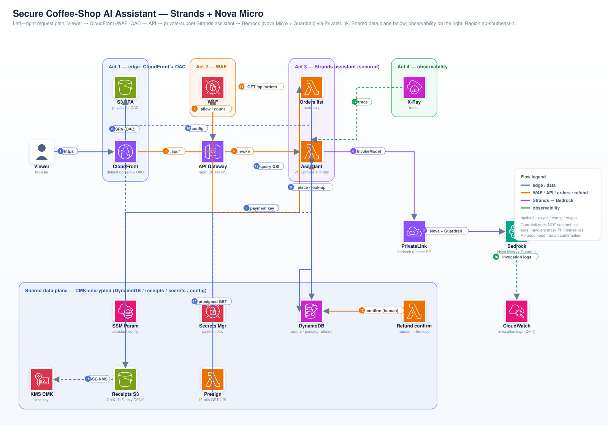

# Session 5 — Secure Coffee-Shop AI Assistant

A standalone AWS CDK v2 (TypeScript) demo that secures a coffee-shop AI
customer-support assistant built with the **Strands Agents SDK**. It teaches the
DVA-C03 **Security & Observability** domain across four acts and runs the agent
on **Amazon Nova Micro** via the APAC inference profile, behind a Bedrock
Guardrail, over a PrivateLink interface endpoint, fronted by CloudFront + a
regional WAF.

Region is pinned to **ap-southeast-1** everywhere. Account **875692608981**.
The VPC is **imported** (never created) via `ec2.Vpc.fromVpcAttributes`.

## Architecture



```
Viewer -> CloudFront (default domain, OAC)
  * default        -> S3 SPA bucket (private via OAC)
  * /api/*         -> regional WAF -> API Gateway -> assistant Lambda (private subnets)
assistant Lambda  -> PrivateLink bedrock-runtime endpoint -> Bedrock Nova Micro (+ Guardrail)
assistant Lambda  -> DynamoDB orders / pending-refunds (CMK) + Secrets Manager + SSM
refund-confirm    -> executes a PENDING refund only after human confirmation
presign Lambda    -> receipts S3 (CMK, TLS-only DENY) -> 15-min presigned GET
Bedrock logs      -> CMK-encrypted CloudWatch Logs + S3
X-Ray             -> API Gateway + all three Lambdas
```

## Layout

```
session5-secure-assistant/
  infra/     CDK app: bin + SecurityData/AppEdgeAI stacks + template test
  app/       Python 3.12 Lambda sources (assistant / refund_confirm / presign)
  spa/       dependency-light chat SPA (index.html + app.js + styles.css)
  diagram/   build_diagram.py (base64 icon-embed) + architecture.svg/.png
  deploy.sh  destroy.sh
  README.md  FACILITATOR-RUNBOOK.md
```

## The four acts

1. **Network & data security** — CloudFront with a private S3 SPA via OAC; the
   API behind a **regional WAF** (`AWSManagedRulesCommonRuleSet` + a rate-based
   rule in **COUNT** mode); a **KMS CMK** encrypting the receipts bucket, both
   DynamoDB tables, and the Bedrock invocation-log destination; a presigned-URL
   Lambda for receipts.
2. **Identity & access** — a receipts bucket **TLS-only DENY** resource policy;
   an **ABAC** policy requiring `aws:ResourceTag/team == aws:PrincipalTag/team`;
   both an **identity policy** (assistant / refund roles) and a **resource
   policy** on the same resources; least-privilege ARNs throughout.
3. **Strands assistant (secured)** — a Python Lambda in **private subnets**
   running a **Strands Agent** with `BedrockModel(apac.amazon.nova-micro-v1:0,
   guardrail wired)`; a **Bedrock Guardrail** (Hate+Violence HIGH, PII mask,
   a BLOCK topic, published version); a **bedrock-runtime interface endpoint**
   with a non-wildcard endpoint policy and a tight SG; `@tool look_up_order`
   and `initiate_refund` where the refund is **human-in-the-loop** (PENDING →
   confirm).
4. **Observability** — X-Ray on API Gateway + the Lambdas, with Bedrock and
   DynamoDB calls instrumented as subsegments; Bedrock
   `ModelInvocationLoggingConfiguration` to a CMK-encrypted CloudWatch log group
   and S3.

## Local verification (no live AWS)

Everything below is local-only — **no** `cdk deploy`, `docker push`, or Bedrock
calls.

```bash
# infra
cd infra && npm install && npx tsc --noEmit
CDK_DEFAULT_ACCOUNT=875692608981 JSII_SILENCE_WARNING_UNTESTED_NODE_VERSION=1 npx cdk synth --all
npm test                           # Template.fromStack assertions

# python
cd .. && python3 -m py_compile $(find app -name '*.py')
python3 -m pytest app/tests -q

# diagram
cd diagram && python3 build_diagram.py && rsvg-convert -o architecture.png architecture.svg

# scripts
cd .. && bash -n deploy.sh && bash -n destroy.sh
```

## Deploy / destroy

`./deploy.sh` creates real, billable resources in ap-southeast-1 (one-time
prereqs: Bedrock Nova Micro model access enabled, the VPC + subnets present,
CDK bootstrap). `./destroy.sh` tears everything down and is guarded — you must
type `destroy`.

See **FACILITATOR-RUNBOOK.md** for the guided walkthrough and the seven security
callouts.
