# APCR-DVA — Content Review Session 3

_AWS Certified Developer – Associate · AWS Partner Certification Readiness_

Converted from `04 - APCR-DVA - Content Review Session 3.pptx`. Each slide is shown as a rendered image followed by its speaker notes.

---

## Slide 1 — Reminders: _(hidden)_

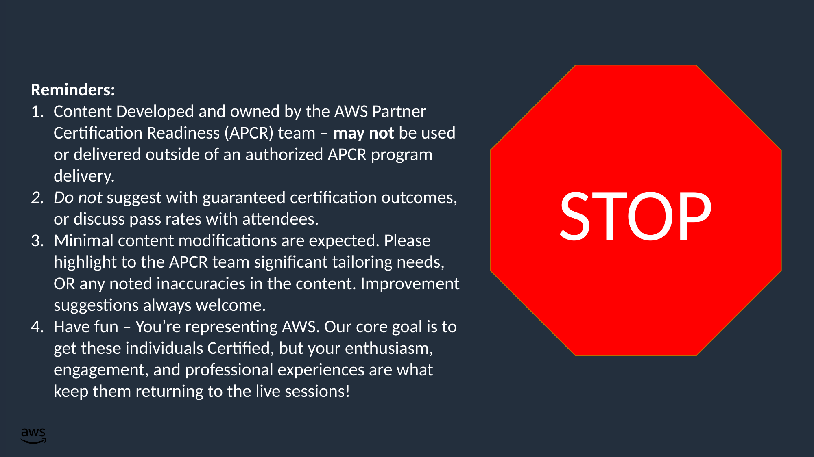

### Notes

FACILITATOR: This slide is hidden on purpose. Confirm it stays hidden, or delete it, before you export a PDF or share the deck with a partner.

The content is APCR-team owned and is licensed only for delivery inside an authorized event. If a partner asks for the deck, point them to the official event materials rather than forwarding this file.

Nothing here is presented to the room. Advance straight past it into the title slide.

---

## Slide 2 — INSTRUCTOR GUIDANCE _(hidden)_

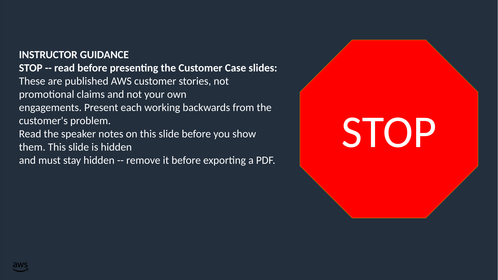

### Notes

WHY THESE SLIDES EXIST: two Customer Case slides ground the session in real customers with real problems. They are NOT promotional. Each works backwards from the customer's challenge, which is why the title is the problem and not the result.

YOU MAY: name the customer exactly as AWS's published page names it; state any figure that appears on that page; describe the services the page names; and point people at the SOURCE link on the slide. Everything on these slides is verified word for word against the published case study.

YOU MAY NOT: add a figure, a service, or an architectural detail that is not on the page. Do not infer how the customer built something. Do not say or imply that an attendee's own customer will get the same result. Do not present these as your own work, and do not use customer logos.

WHY THE RULES ARE THIS TIGHT: a published case study has already been through the customer's own legal and marketing approval, and that approval covers presentations. Anything added on top of it has been approved by nobody, so an added detail is the one thing that turns an approved reference into a problem.

IF A LINK IS DEAD, DROP THE SLIDE. Customer consent can be withdrawn, and AWS then removes the page. A case-study URL that stops working may mean permission lapsed rather than a broken link, so do not present it from a cached copy or an older deck. Tell the APCR team instead.

ON SPEAKING FOR AWS: present these as AWS's published customer stories, not as an AWS position you are announcing and not as your own findings. If someone asks a question the page does not answer, the honest answer is that the case study does not say, and you can follow up.

---

## Slide 3 — Content Review — Session 3

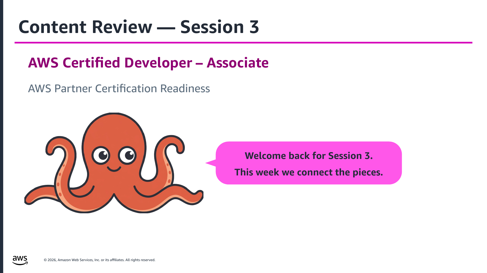

### Notes

FACILITATOR: The opening slide for the third content-review session. Welcome the room back and set the frame: this week is about the services that connect and observe an application -- messaging and events, caching, user authentication, and monitoring.

Say what the next two hours look like -- roughly half is a fast re-grounding in the week-three services, and half is exam-strategy practice on live questions.

Keep this short. Everyone here has a fortnight of study behind them; pitch it as a working session, not a lecture.

---

## Slide 4 — Event check-in

### Notes

FACILITATOR: A quick pulse check before the content starts. Ask how week two landed -- who finished the digital training, who feels behind, and what got in the way.

Some people will have fallen behind, and that is normal. Be encouraging and share a little of your own study experience so the room relaxes and talks.

Keep it to two or three minutes, then move into the week-three curriculum.

---

## Slide 5 — Week 3 digital training

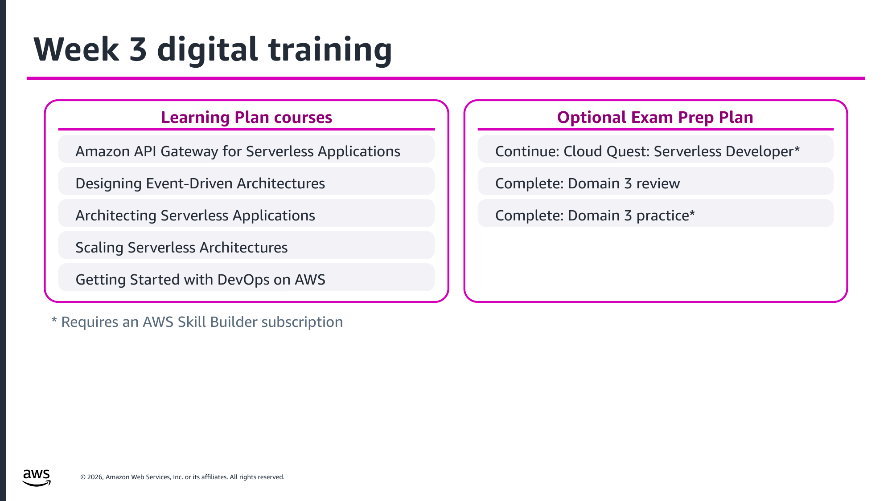

### Notes

WHAT'S HERE: This week's training checklist. The left card is the free Learning Plan; the right card is the optional Exam Prep Plan a subscriber can add.

FACILITATOR: Use this as a check-in. Ask how people are doing and relate it to your own experience studying for the exam -- which modules stood out, what your key takeaways were. Week three leans on event-driven and serverless design, which is exactly what today's messaging, caching and monitoring blocks build on.

Remind the room of the value of Cloud Quest -- the lab practice in particular -- and check whether anyone has tried the labs yet.

Note: the item names beginning "Domain 3" are the actual Exam Prep Plan module names in Skill Builder, so learners can find them; they are navigation, not exam-coverage claims. Keep any talk of exam weighting off this slide.

---

## Slide 6 — Today's focus: Development with AWS Services

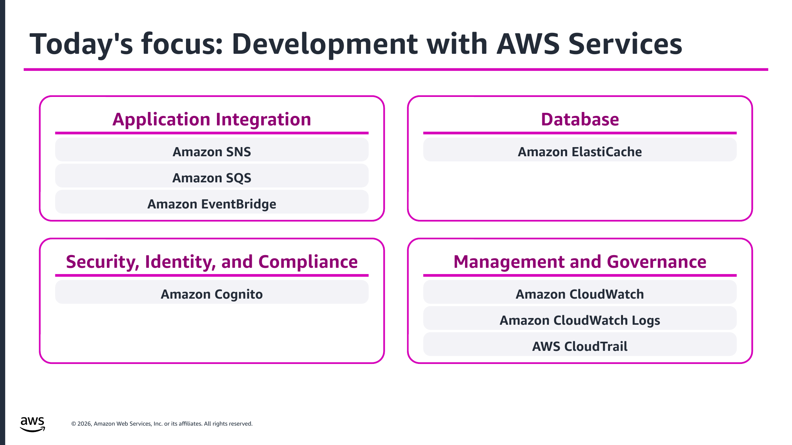

### Notes

WHAT'S HERE: The services this session works through, grouped by the role they play. Application integration -- SNS, SQS, and EventBridge -- is how the pieces are decoupled and events routed; ElastiCache is the caching tier; Cognito handles user authentication; and CloudWatch, CloudWatch Logs, and CloudTrail are how the running application is observed.

FACILITATOR: Use this as a one-slide map of the session. Point out that most of the time goes on messaging and monitoring, with shorter caching and authentication segments in between.

Set the expectation that everyone here has seen these services before; the job today is to go one level deeper into how a developer actually builds with them and where the exam tends to probe.

Then move into the first section, Application Integration.

---

## Slide 7 — Your five weeks at a glance

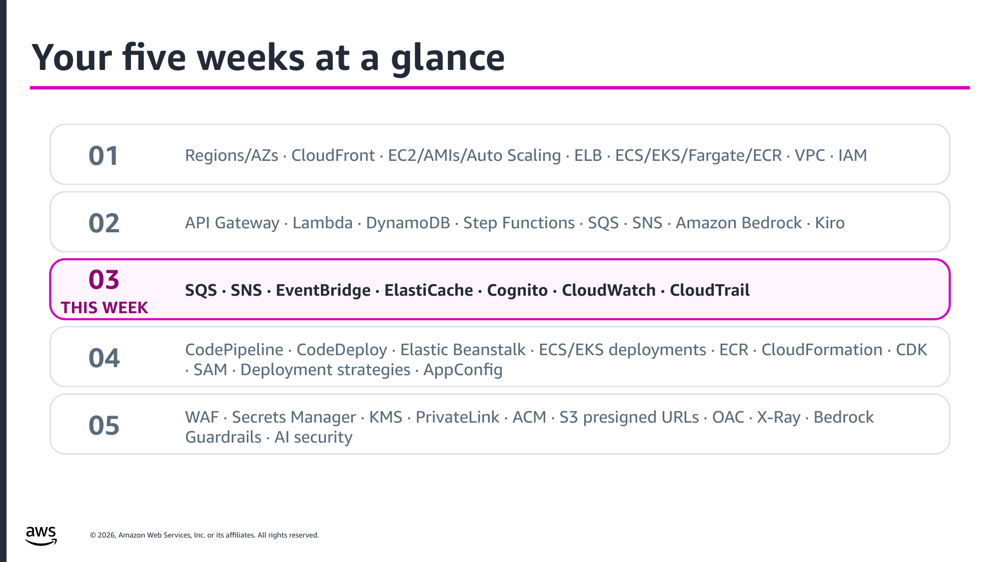

### Notes

WHAT'S HERE: A map of the whole five-week event, one row per week, with this week highlighted. Use it near the top of the session so the room can see where week 3 sits in the arc and what is still to come.

FACILITATOR: Point at the highlighted row. Week 2 is the developing-with-core-services week -- API Gateway, Lambda, DynamoDB, Step Functions, and the messaging services that decouple them, plus the AI services added this cycle, Amazon Bedrock and Kiro. Note how it builds on week 1's compute and networking foundations and sets up the deployment and security weeks that follow.

Keep it brief -- this is orientation, not content. The same map appears in every session with the current week moving, so returning attendees will recognize it at a glance. Then move into today's focus.

---

## Slide 8 — How do services stay decoupled?

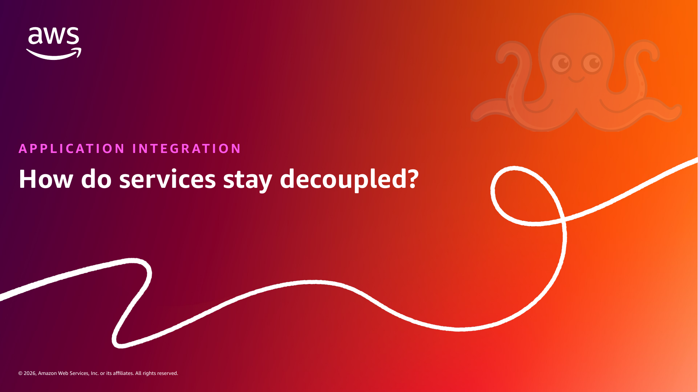

### Notes

WHAT'S HERE: The section opener for application integration. Put the question to the room: once you have more than one service, how do they pass work between each other without being tightly wired together? Take a couple of answers before moving on. Everyone here already met queues and topics in the last session, so treat this as going one level deeper rather than a first introduction.

EXAM RELEVANCE: Decoupling producers from consumers is a core development idea on this exam. The services ahead -- Amazon SQS, Amazon SNS, and Amazon EventBridge -- are the ones most integration answers are built on, so the goal is to know which one a scenario is pointing at.

PARTNER CONTEXT: When a customer's application starts to strain because one slow component holds up everything upstream, integration services are usually the fix a partner reaches for -- a buffer or a router that lets each piece work at its own pace.

EXAM MAPPING: Domain 1, Development with AWS Services (, event-driven and decoupled patterns).

REFERENCE: https://docs.aws.amazon.com/AWSSimpleQueueService/latest/SQSDeveloperGuide/welcome.html

---

## Slide 9 — Two jobs: buffer the work, or route the event

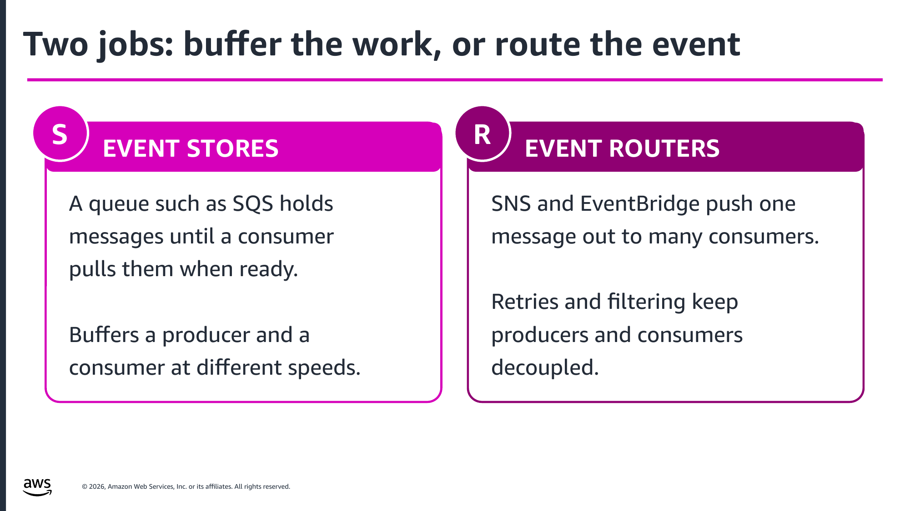

### Notes

WHAT'S HERE: A one-slide map of the integration toolkit. Some services act as event stores: a queue such as Amazon SQS holds messages so a consumer can pull them when it is ready, which puts a buffer between a producer and a consumer running at different speeds. Others act as event routers: Amazon SNS and Amazon EventBridge push a message out to many consumers at once, with automatic retries and the ability to filter, so producers and consumers stay decoupled.

EXAM RELEVANCE: Match the shape of the scenario to the category. Work that must be absorbed and processed at the consumer's pace points at a queue; an event that several independent consumers each need a copy of points at a topic or an event bus.

PARTNER CONTEXT: Framing the choice as store-versus-route helps a customer pick the right service the first time, rather than bolting a queue onto a problem that actually needed fan-out.

EXAM MAPPING: Domain 1 (decouple components) and (event-driven patterns).

REFERENCE: https://docs.aws.amazon.com/eventbridge/latest/userguide/eb-what-is.html

---

## Slide 10 — A dead-letter queue catches failing messages

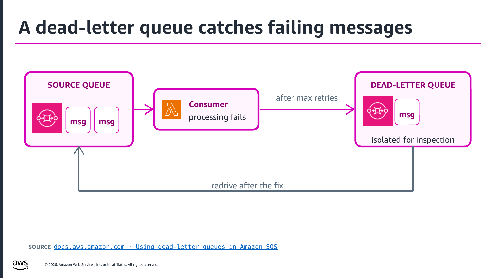

### Notes

WHAT'S HERE: the lifecycle of a message that will not process. Follow it left to right -- it sits in the source queue, a consumer receives it, and the processing fails. It goes back and is tried again.

Point at the chip in the middle. After the number of receives you configure, the message stops being retried in place and is moved to a separate dead-letter queue, where it is isolated rather than lost.

The dashed path along the bottom is redrive. Once you have found and fixed the bug, you send the isolated messages back to the source queue to be processed normally.

So a dead-letter queue is not an error bin you ignore -- it is a holding area that keeps a poison message from blocking the queue while preserving it for inspection.

EXAM RELEVANCE: a scenario describing a message that repeatedly fails and blocks a queue, or a need to inspect failed messages without losing them, is pointing at a dead-letter queue and its maxReceiveCount.

PARTNER CONTEXT: a customer whose queue stalls on one bad message usually has no dead-letter queue configured, so a single unprocessable item halts everything behind it.

EXAM MAPPING: Domain 1.

Verified against https://docs.aws.amazon.com/AWSSimpleQueueService/latest/SQSDeveloperGuide/sqs-dead-letter-queues.html

---

## Slide 11 — Standard scales throughput, FIFO preserves order

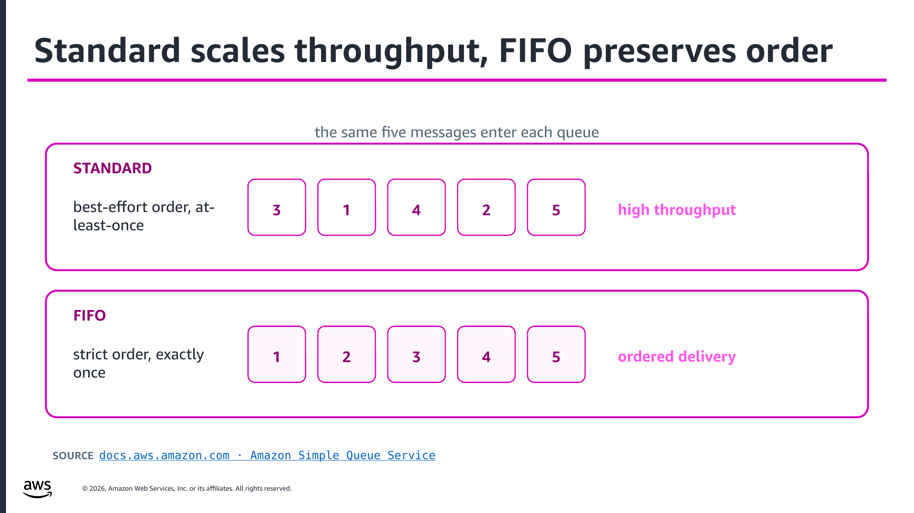

### Notes

WHAT'S HERE: the same five messages entering two different queues, so the only thing that changes between the lanes is what comes out.

On the top lane, a standard queue delivers with best-effort ordering and at-least-once delivery, so a consumer may see the messages out of order and may occasionally see one twice. In return it scales to very high throughput.

On the bottom lane, a FIFO queue preserves the exact order and processes each message exactly once. That guarantee is what you trade some throughput for.

Say the choosing question out loud: does the order of these messages matter, and would processing one twice cause a problem? If yes, that is a FIFO queue.

EXAM RELEVANCE: a scenario stressing strict ordering or no duplicates points at FIFO; one stressing maximum throughput where order does not matter points at standard.

PARTNER CONTEXT: a customer processing financial transactions or a command sequence usually needs FIFO, while one ingesting independent events is fine on standard and cheaper for it.

EXAM MAPPING: Domain 1.

Verified against https://docs.aws.amazon.com/AWSSimpleQueueService/latest/SQSDeveloperGuide/FIFO-queues.html

---

## Slide 12 — A topic pushes one message to every subscriber

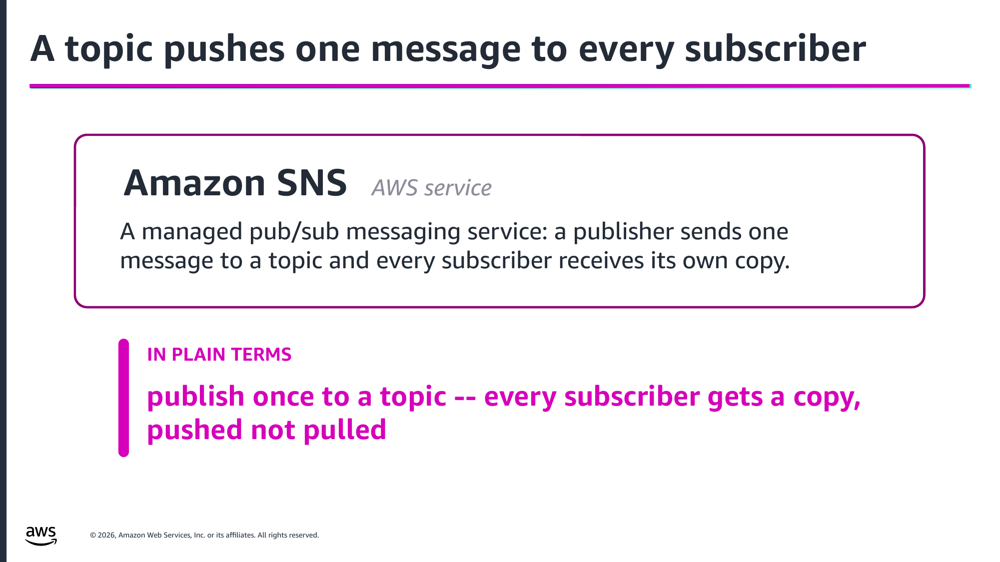

### Notes

WHAT'S HERE: A quick recap of Amazon SNS, which you met last session. A publisher sends one message to a topic and every subscriber to that topic receives its own copy, pushed to endpoints such as SQS queues, Lambda functions, or HTTP endpoints. The contrast to hold onto is delivery model: a queue delivers a message to a single consumer that pulls when ready, while a topic pushes a copy to many consumers at once. The two combine in the fan-out pattern -- a topic in front of several queues -- which was covered in the previous session, so today we only place it against the routers that follow.

EXAM RELEVANCE: Keep the one-to-one versus one-to-many distinction sharp. A requirement that several independent systems each act on the same event points at a topic; a requirement that one worker process each message exactly once points at a queue.

PARTNER CONTEXT: When a customer needs the same event to trigger several downstream actions -- update a database, notify a service, kick off processing -- a topic subscribed by multiple endpoints does it without the publisher knowing who is listening.

EXAM MAPPING: Domain 1 (decouple components) and (fan-out with SNS).

REFERENCE: https://docs.aws.amazon.com/sns/latest/dg/welcome.html

---

## Slide 13 — EventBridge routes on the content of an event

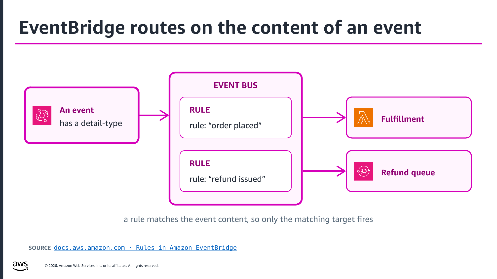

### Notes

WHAT'S HERE: an event arriving at an event bus, and two rules that inspect what the event contains. Point at the rules -- each one describes a pattern, and only the target behind a matching rule is invoked.

That is the distinction from a topic. A topic pushes every message to every subscriber; an event bus reads the content of the event and routes it to the target whose rule matches.

So the routing decision lives in the rule, not in the sender. Adding a new consumer for a new kind of event is a new rule, and the producer never changes.

Contrast this with the fan-out you saw earlier, where the point was that every subscriber receives the same message. Here the point is selective routing on content.

EXAM RELEVANCE: a scenario where different events must go to different handlers based on their content is pointing at EventBridge rules, not at a topic that delivers everything to everyone.

PARTNER CONTEXT: a customer wiring one big handler that inspects every message and decides what to do is describing logic that a set of content rules can do for them.

EXAM MAPPING: Domain 1.

Verified against https://docs.aws.amazon.com/eventbridge/latest/userguide/eb-rules.html

---

## Slide 14 — Working backwards: one message, too many queues

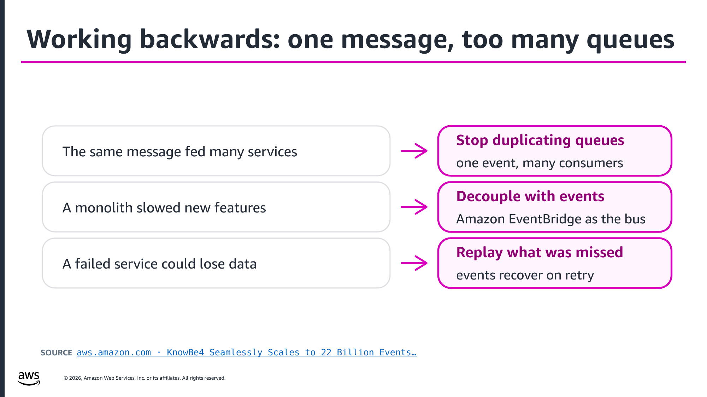

### Notes

WHAT'S HERE: A published AWS case study, so every figure here is KnowBe4's and AWS's rather than ours. KnowBe4 is a cybersecurity training company. Read the rows left to right and you are working backwards from the customer's problem.

THE SETUP: KnowBe4's services kept sending the same message to many consumers, so its teams built queue after queue for each one. The duplication slowed new features, and a mostly monolithic core made every change harder than it should have been.

THE DECISION: KnowBe4 moved to a serverless, event-driven architecture on Amazon EventBridge. A producer publishes an event once and the bus routes a copy to every service that cares. The sender does not track who is listening, so teams add consumers without touching it.

EXAM RELEVANCE: this is the messaging material one level deeper than a queue or a topic. When one event must reach many independent services and the sender should not track them, that points at an event bus routing on content, rather than a fan of hand-built queues.

IF THEY ASK ABOUT RESULTS: the page reports the architecture was designed for bursts up to 20,000 events per second, managed 22 billion events in 2024, and held 99.99 percent uptime, with two new features shipping 3 months ahead of schedule.

PARTNER CONTEXT: when a customer keeps wiring a new queue for every consumer of one message, that is the signal to introduce an event bus. It decouples the sender from a growing list of subscribers, and a service that had issues can replay the events it missed.

EXAM MAPPING: Domain 1 (event-driven architecture with Amazon EventBridge).

ON DELIVERY: the SOURCE link is the published case study. Put it on screen and say plainly that this is the customer we are discussing. Tell the room these pages reward their own time afterwards -- not as exam preparation, but to see the services working together for a real customer.

REFERENCE: https://aws.amazon.com/solutions/case-studies/knowbe4-case-study/

---

## Slide 15 — When is a cache the right call?

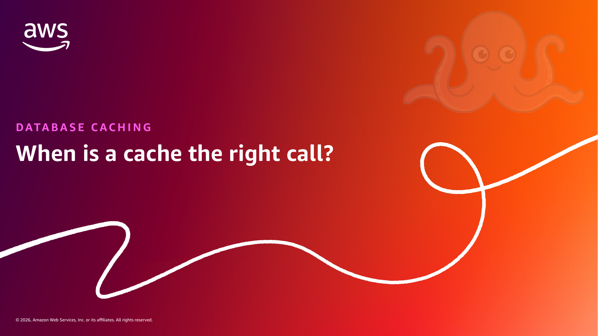

### Notes

WHAT'S HERE: The section opener for caching. Put the question to the room before defining anything: when does putting a cache in front of a database actually help, and when is it just another moving part? Take an answer or two. The block is short -- what ElastiCache is, the two engines, and the two strategies for keeping a cache populated.

EXAM RELEVANCE: Caching shows up as a performance-and-cost lever on this exam. The judgement being tested is when an in-memory cache is the right fit for an access pattern, and which strategy keeps the cached data usable.

PARTNER CONTEXT: When a customer's database is hot on the same reads over and over, a cache is often the cheapest large win available -- but only for the right data, which is exactly the judgement this section builds.

EXAM MAPPING: Domain 1, Development with AWS Services (, data stores and caching).

REFERENCE: https://docs.aws.amazon.com/AmazonElastiCache/latest/dg/elasticache-use-cases.html

---

## Slide 16 — ElastiCache is managed, in-memory caching

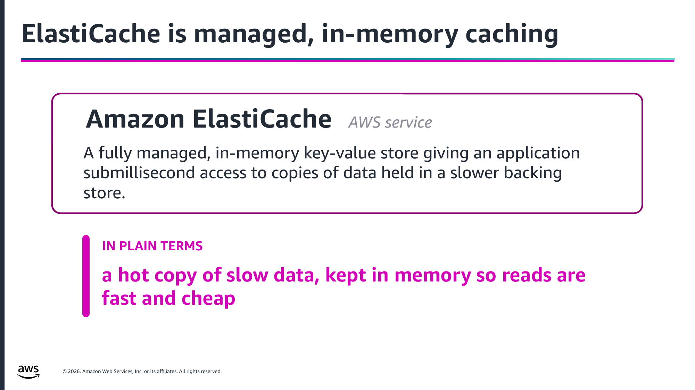

### Notes

WHAT'S HERE: Amazon ElastiCache is a fully managed, in-memory key-value store that gives an application submillisecond access to copies of data it would otherwise fetch from a slower backing store. The point of the cache is speed and cost: reading from memory is far faster and cheaper than re-running an expensive query. It is a good fit when the data is slow or expensive to get relative to a cache read, when the same data is accessed often, and when the data changes slowly enough that a little staleness is acceptable.

EXAM RELEVANCE: Match the access pattern to the decision. A scenario with hot, repeated reads over data that does not change every second is a caching scenario. One that needs every read to reflect the very latest write is not, unless the caching strategy guarantees freshness -- which is the next slide.

PARTNER CONTEXT: The three conditions on the right are the quick test a partner can apply with a customer before recommending a cache, so the cache goes where it pays off rather than everywhere.

EXAM MAPPING: Domain 1 (choose a data store by access pattern) and (ElastiCache).

REFERENCE: https://docs.aws.amazon.com/AmazonElastiCache/latest/dg/elasticache-use-cases.html

---

## Slide 17 — Memcached is simple, Redis adds data structures

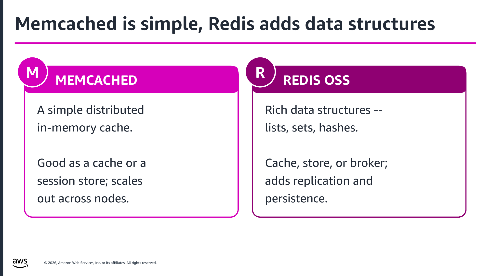

### Notes

WHAT'S HERE: ElastiCache offers more than one engine. Memcached is a straightforward distributed memory cache, well suited as a simple cache or a session store and easy to scale out across nodes. Redis OSS is an in-memory data structure store with a much richer feature set -- lists, sets, sorted sets, hashes and more -- so it works as a cache, a lightweight data store, or a message broker, and it supports replication and persistence that Memcached does not.

EXAM RELEVANCE: Match the requirement to the engine. A scenario asking only for a fast, simple cache or session store points at Memcached. One that needs data structures, replication, persistence, or pub/sub features points at Redis. Keep the distinction at the level of capabilities rather than memorizing every data type.

PARTNER CONTEXT: For a customer who only needs to cache query results, the simpler engine is usually the easier operational choice; the richer engine earns its keep when they need its features, not by default.

EXAM MAPPING: Domain 1 (choose the caching engine that fits the workload).

REFERENCE: https://docs.aws.amazon.com/AmazonElastiCache/latest/dg/SelectEngine.html

---

## Slide 18 — Lazy loading fills on read, write-through on write

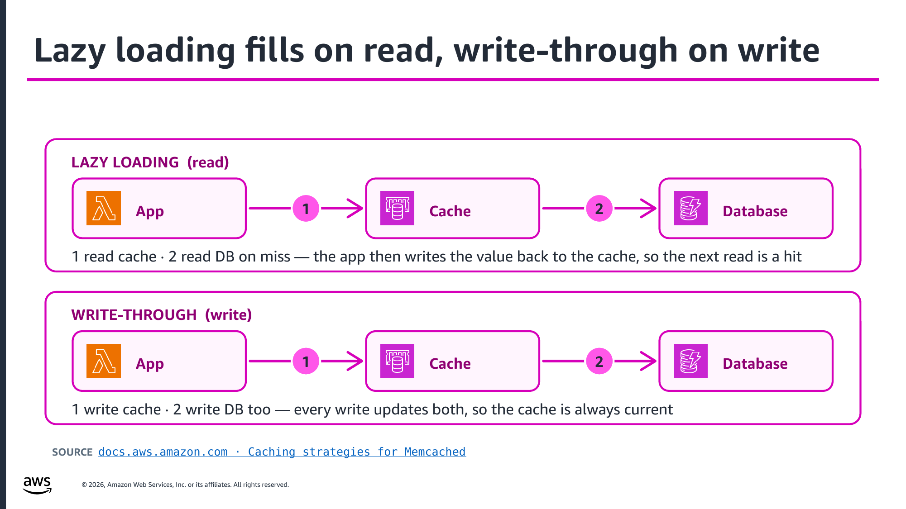

### Notes

WHAT'S HERE: the two caching strategies as two ordered paths. The top path is a read; the bottom is a write. Read the numbers in order on each.

Lazy loading fills the cache only when something is asked for. The application reads the cache, and on a miss it reads the database and then populates the cache, so the next read of that item is fast. The cache holds only what has actually been requested.

Write-through updates the cache every time the application writes. The data is written to the cache and the database together, so a later read is a hit -- but you are caching data that may never be read.

Say the trade: lazy loading risks a stale entry and a slow first read; write-through keeps the cache current but writes data that may go unused.

EXAM RELEVANCE: a scenario about a cold cache or serving only requested data points at lazy loading; one about keeping the cache always current on write points at write-through.

PARTNER CONTEXT: a customer with a read-heavy workload and a large dataset usually starts with lazy loading, adding write-through only for data that must be fresh the instant it changes.

EXAM MAPPING: Domain 1.

Verified against https://docs.aws.amazon.com/AmazonElastiCache/latest/dg/Strategies.html

---

## Slide 19 — How do users sign in and get access?

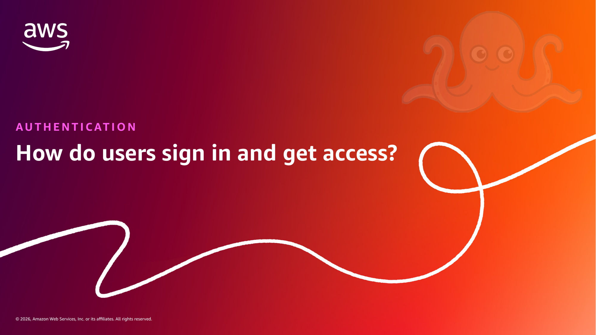

### Notes

WHAT'S HERE: The section opener for authentication. Put the two questions to the room: how does an application know who a user is, and how does it then let that user reach an AWS service on their own behalf? Those are two different jobs -- proving identity, and granting access -- and Amazon Cognito is the service that does both for web and mobile apps.

EXAM RELEVANCE: This is a security-domain topic, and the distinction being tested is authentication versus authorization. Keep them separate in your head, because the two Cognito components map onto exactly that split.

PARTNER CONTEXT: When a customer building a mobile or web app asks how to handle sign-in without running their own identity system, Cognito is usually the answer a partner reaches for -- a managed directory plus a way to hand out short-lived AWS access.

EXAM MAPPING: Domain 2, Security (, authentication and authorization for applications).

REFERENCE: https://docs.aws.amazon.com/cognito/latest/developerguide/what-is-amazon-cognito.html

---

## Slide 20 — Cognito handles sign-in and AWS access

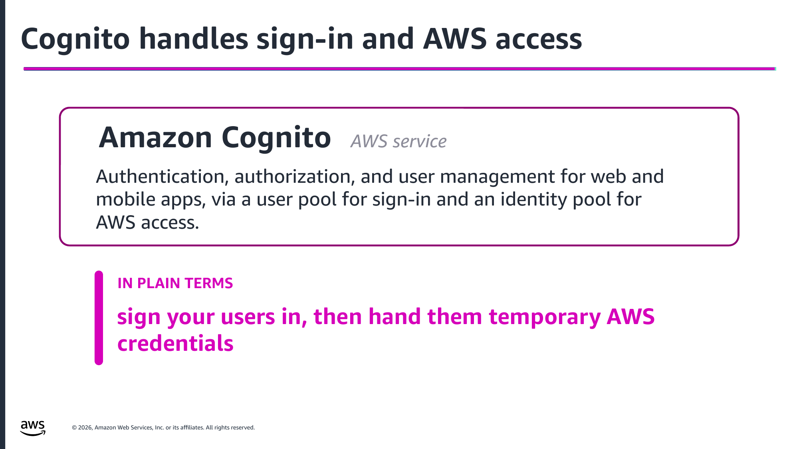

### Notes

WHAT'S HERE: Amazon Cognito provides authentication, authorization, and user management for web and mobile apps, and it has two main components. A user pool is a user directory: it gives your app sign-up and sign-in, and users can authenticate directly with a username and password or through a third party such as Google, Apple, or a SAML provider. An identity pool grants users access to other AWS services by handing out temporary AWS credentials. The two are separable -- you can use a user pool alone for sign-in, an identity pool alone for access, or both together.

EXAM RELEVANCE: Hold the split precisely. The user pool answers who the user is (authentication); the identity pool answers what AWS resources the user may reach (authorization, via temporary credentials). A scenario about signing users in points at a user pool; one about letting a signed-in user call an AWS service points at an identity pool.

PARTNER CONTEXT: For a customer who already has an identity provider, the user pool federates to it rather than replacing it, so users keep one login while the app still gets a consistent token to work with.

EXAM MAPPING: Domain 2 (identity federation) and (authenticated calls to AWS).

REFERENCE: https://docs.aws.amazon.com/cognito/latest/developerguide/what-is-amazon-cognito.html

---

## Slide 21 — Sign in to a user pool, then access AWS services

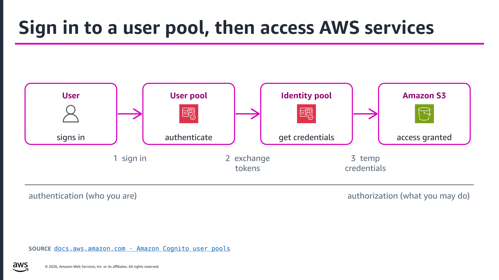

### Notes

WHAT'S HERE: the sign-in journey, in order. The user signs in, a user pool authenticates them, an identity pool exchanges the result for temporary AWS credentials, and only then does the app call an AWS service.

Point at the split named on the axis. The user pool answers who you are -- it is authentication, and it returns tokens. The identity pool answers what you may do -- it takes those tokens and hands back short-lived credentials scoped to a role.

Those credentials are temporary and expiring, which is the security payoff: the app never holds a long-lived key, and access ends when the credentials do.

The two pools are what learners confuse. One proves identity; the other grants access to AWS resources. You often use both, in this order.

EXAM RELEVANCE: a scenario about signing users in points at a user pool; one about giving those signed-in users scoped access to an AWS service such as S3 points at an identity pool and temporary credentials.

PARTNER CONTEXT: a customer embedding long-lived keys in a mobile or web client is describing exactly the risk this flow removes, because the client only ever receives credentials that expire.

EXAM MAPPING: Domain 2.

Verified against https://docs.aws.amazon.com/cognito/latest/developerguide/cognito-user-identity-pools.html

---

## Slide 22 — How do you see what your app does?

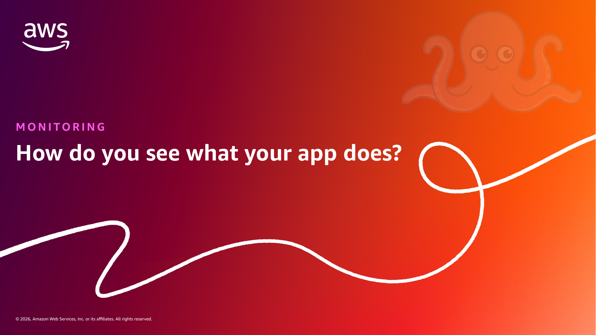

### Notes

WHAT'S HERE: The section opener for monitoring, and the largest block this week. Ask the room how they would find out why a running application is slow, erroring, or behaving oddly -- and take a couple of answers. The tools ahead answer three different questions: who did what, how the system is performing, and what happened in the logs.

EXAM RELEVANCE: Monitoring and troubleshooting is a substantial part of this exam, and the questions are practical: read a metric, interpret a log, decide what an alarm should do. Keep the three tools -- CloudTrail, CloudWatch, and CloudWatch Logs -- clearly separated by the question each answers.

PARTNER CONTEXT: When a customer's application misbehaves in production, the first partner question is usually "what does the telemetry say," and whether the right telemetry was even being collected -- which is exactly what this block sets up.

EXAM MAPPING: Domain 4, Troubleshooting and Optimization (and, observability).

REFERENCE: https://docs.aws.amazon.com/AmazonCloudWatch/latest/monitoring/WhatIsCloudWatch.html

---

## Slide 23 — CloudTrail logs who acted, CloudWatch how it runs

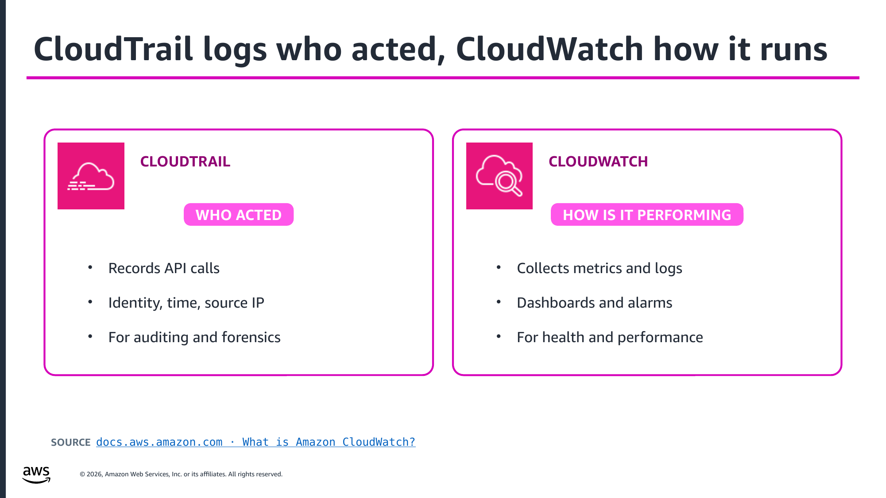

### Notes

WHAT'S HERE: the two services developers mix up, side by side, with the question each one answers printed on it. Both panels are the same size on purpose, so the difference is the job, not the layout.

CloudTrail records who acted. It logs API calls -- the identity, the time, the source -- and it is what you reach for to audit or investigate what happened in the account.

CloudWatch tracks how the system is performing. It collects metrics and logs, drives dashboards and alarms, and it is what you reach for to watch health and react to problems.

Say the split as a sentence: CloudTrail is who did what; CloudWatch is how is it doing. A single scenario usually only needs one of them.

EXAM RELEVANCE: a scenario about auditing an action or finding who made a change points at CloudTrail; one about a performance metric, a threshold, or an alarm points at CloudWatch.

PARTNER CONTEXT: a customer asking who deleted a resource needs CloudTrail, while one asking why latency spiked needs CloudWatch -- naming which question they are asking picks the service.

EXAM MAPPING: Domain 4.

Verified against https://docs.aws.amazon.com/AmazonCloudWatch/latest/monitoring/WhatIsCloudWatch.html

---

## Slide 24 — Reading a CloudTrail management event

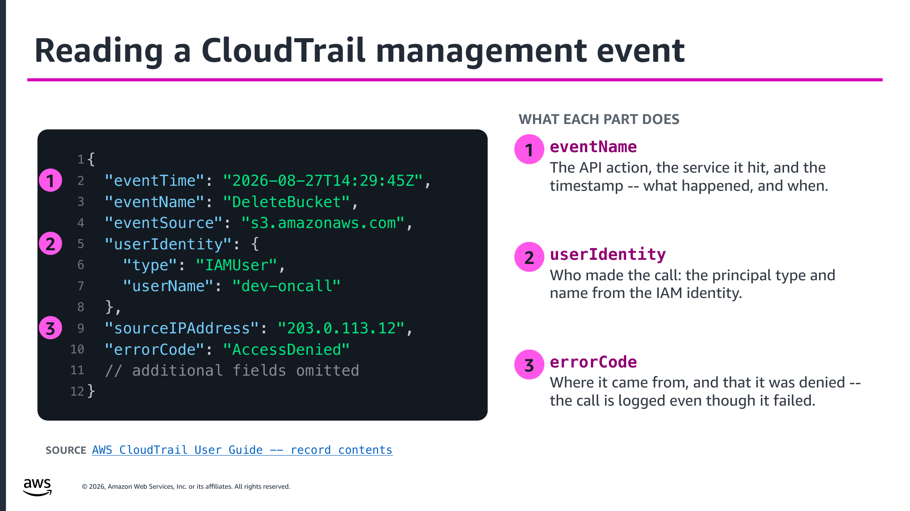

### Notes

CloudTrail records every API call as a JSON event. This is what a management event looks like when someone tries to delete an S3 bucket and is refused. Point the room at the overall shape first, then read the fields that answer the audit question.

The first three fields answer what and when: eventName is the API action, eventSource is the service it hit, and eventTime stamps it in UTC. Read them together as one thought.

userIdentity answers who. For an IAM user you get the type and the user name; for a role you would instead see the assumed-role session. This is the field an audit starts from.

sourceIPAddress says where the call originated, and errorCode tells you it did not succeed. AccessDenied means the permission was missing -- and the point of an audit trail is that the attempt is recorded either way.

Verified against: https://docs.aws.amazon.com/awscloudtrail/latest/userguide/cloudtrail-event-reference-record-contents.html

---

## Slide 25 — A log group holds streams, a stream holds events

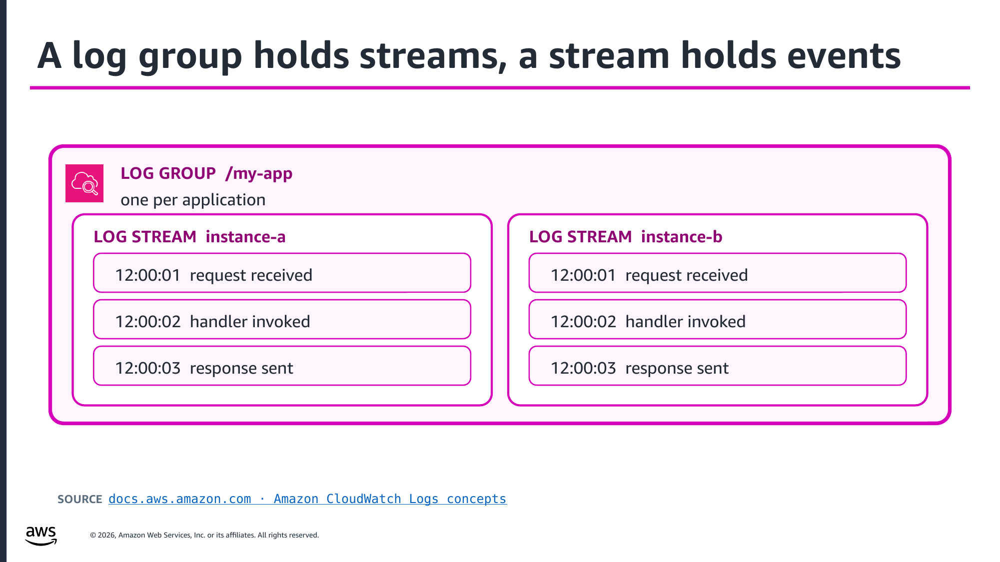

### Notes

WHAT'S HERE: how CloudWatch Logs is organized, drawn as containment. The outer box is a log group, the boxes inside it are log streams, and the rows inside each stream are log events. Nothing says contains -- the nesting says it.

Point at the group first: it is one logical destination, usually one per application. Inside it, each stream is a separate source of events -- commonly one per instance or function version.

Inside a stream, the events are the individual log lines, in the order they occurred. The timestamps are shown to make that ordering visible.

The vocabulary is the lesson: group, stream, event. Knowing which level you are naming is what makes a logging question readable.

EXAM RELEVANCE: a scenario about where an application's logs land, or about separating logs from different instances, is a question about groups and streams.

PARTNER CONTEXT: a customer sending everything to one stream loses the ability to tell sources apart, so naming the group-and-stream structure early saves a painful reorganization later.

EXAM MAPPING: Domain 4.

Verified against https://docs.aws.amazon.com/AmazonCloudWatch/latest/logs/CloudWatchLogsConcepts.html

---

## Slide 26 — A metric crosses a threshold and the alarm acts

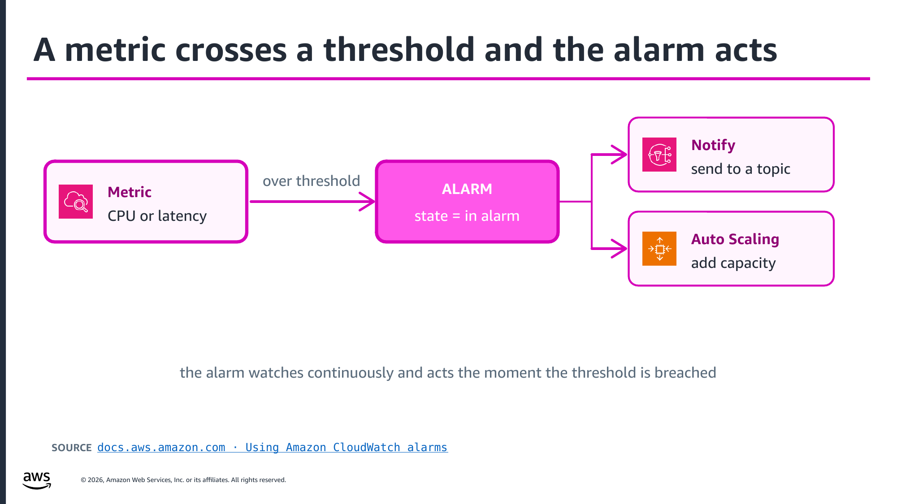

### Notes

WHAT'S HERE: an ordered chain from a measurement to a response. A metric is collected, it crosses a threshold you set, the alarm changes state, and the alarm fires an action.

Point at the threshold chip. The alarm is not watching a single reading -- it watches whether the metric stays over the threshold for the period you configure, which is what stops a momentary spike from firing it.

When the alarm enters the in-alarm state, it acts. Follow the two arrows at the end: it can notify a topic so a person or system hears about it, or it can drive an Auto Scaling response to add capacity.

So an alarm is a metric plus a rule plus an action. All three have to be set for anything to happen.

EXAM RELEVANCE: a scenario describing an automatic reaction when a measurement crosses a limit -- a notification, or adding capacity under load -- is describing a CloudWatch alarm and its action.

PARTNER CONTEXT: a customer watching a dashboard by hand to decide when to scale is describing work an alarm and its action can do without a person in the loop.

EXAM MAPPING: Domain 4.

Verified against https://docs.aws.amazon.com/AmazonCloudWatch/latest/monitoring/AlarmThatSendsEmail.html

---

## Slide 27 — Working backwards: spend changed in one click

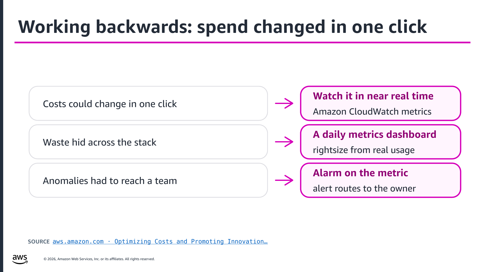

### Notes

WHAT'S HERE: A published AWS case study, so the figures here are Wix's and AWS's rather than ours. Wix provides cloud-based website-building tools. Read the rows left to right: this is working backwards from the customer's problem.

THE SETUP: when Wix moved to AWS, buying decisions shifted from procurement specialists to engineers. In one click an engineer could change the monthly bill, and the finance team had little near-real-time visibility into what was driving that cost.

THE DECISION: Wix built its financial monitoring on Amazon CloudWatch. It tracks metrics across the stack, feeds a daily waste dashboard, and raises alerts when something anomalous happens, so an owner hears about a spike in minutes rather than hours.

EXAM RELEVANCE: this is the monitoring material made real. A scenario about seeing a change as it happens and reacting to it points at a metric with an alarm on it. The alarm is what turns a watched number into an action a team actually receives.

IF THEY ASK ABOUT RESULTS: the page reports Wix reduced its Amazon DynamoDB costs by over 50 percent by reading CloudWatch metrics and rightsizing capacity, then applied the same approach across a stack serving over 260 million users in 190 countries.

PARTNER CONTEXT: when a customer worries that cloud spend stays invisible until the invoice arrives, this is the first move: put the numbers that matter on a CloudWatch metric, set an alarm, and route it to the team that owns the workload.

EXAM MAPPING: Domain 4 (observability with Amazon CloudWatch metrics and alarms).

ON DELIVERY: the SOURCE link is the published case study. Put it on screen and say plainly that this is the customer we are discussing. Tell the room these pages reward their own time afterwards -- not as exam preparation, but to see the services working together for a real customer.

REFERENCE: https://aws.amazon.com/solutions/case-studies/wix-amazon-cloudwatch-case-study/

---

## Slide 28 — Apply what you've learned

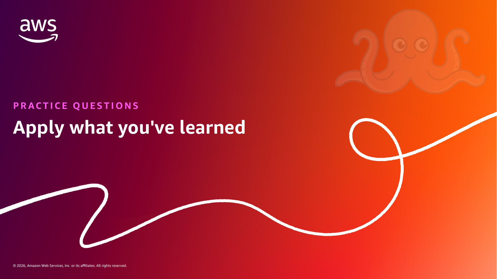

### Notes

FACILITATOR: This marks the shift from teaching to practice. The next questions apply this week's application-integration, caching, authentication, and monitoring services to scenario-style problems.

Frame it as a low-stakes checkpoint. The aim is to surface which services still feel unclear, not to score anyone. Ask the room to read each stem carefully and note the key phrases before looking at the choices.

Remind everyone that the four-beat rhythm -- read, find the key phrases, reveal, then walk through why -- is a study technique they can reuse on their own practice sets.

---

## Slide 29 — Question 1: One event, three independent actions

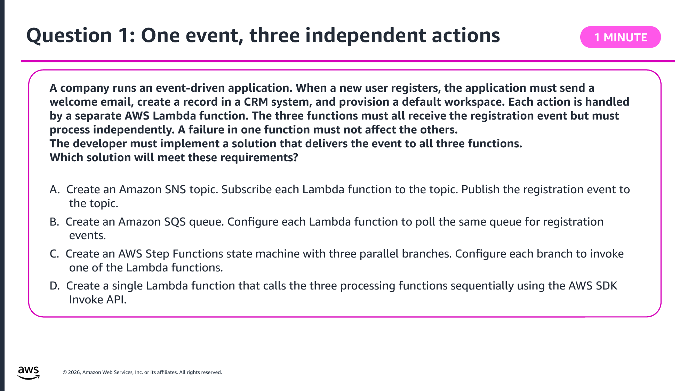

### Notes

WHAT'S HERE: put question 1 on screen and give the room about 90 seconds to read it in silence and commit to an answer before anyone speaks aloud. That is close to the pace the exam demands, so this rehearses timing as much as content.

Do not reveal or hint at the answer on this beat. The silent read is what makes the key-phrases beat and the reveal land -- if you talk through it now, both lose their effect.

EXAM RELEVANCE: Domain 1: Development with AWS Services. Difficulty: Medium. Watch the room: if most people have answered by 90 seconds, move on; if they are still reading, give another 20 seconds rather than rushing the discussion that follows.

PARTNER CONTEXT: A customer's onboarding flow must fire several independent actions from one sign-up event -- a welcome email, a CRM record, a default workspace -- and one slow or failing step must not block the rest. An SNS topic with each function subscribed gives every consumer its own copy and its own failure domain, so a fourth action can be added later without touching the first three. This is the contrast that sets up EventBridge: SNS fans out to subscribers, EventBridge routes on the content of the event.

EXAM MAPPING: Domain 1: Development with AWS Services.

---

## Slide 30 — Question 1: One event, three independent actions

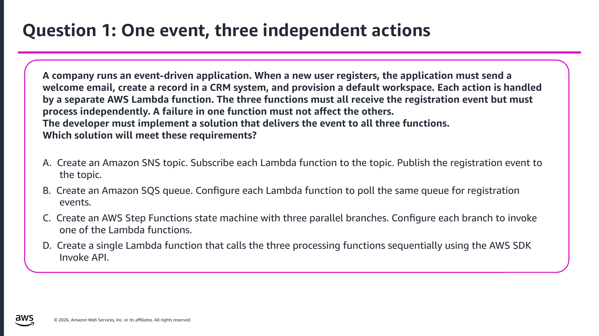

### Notes

KEY PHRASES: walk the question, do not answer it yet. The phrase that decides it is “must all receive the registration event but must process independently”, and it tells you: Deliver one event to many independent consumers points to an SNS topic.

WHAT'S HERE: the same question with the timer removed. This beat teaches HOW to read a scenario question -- find the requirement, then find the words that separate options that all look plausible on a first pass.

EXAM RELEVANCE: Domain 1: Development with AWS Services. Difficulty: Medium. Ask the room which words they underlined before you show them the tell, so they practise finding it rather than being handed it.

PARTNER CONTEXT: A customer's onboarding flow must fire several independent actions from one sign-up event -- a welcome email, a CRM record, a default workspace -- and one slow or failing step must not block the rest. An SNS topic with each function subscribed gives every consumer its own copy and its own failure domain, so a fourth action can be added later without touching the first three. This is the contrast that sets up EventBridge: SNS fans out to subscribers, EventBridge routes on the content of the event.

EXAM MAPPING: Domain 1: Development with AWS Services.

---

## Slide 31 — Question 1: One event, three independent actions

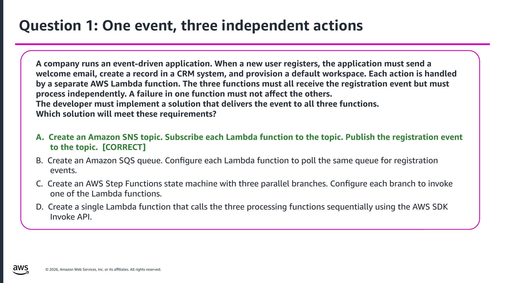

### Notes

ANSWER OVERVIEW: the answer is A. SNS delivers every event to all subscribers, independently.

A. Create an Amazon SNS topic. Subscribe each Lambda function to the topic. Publish the registration event to the topic. — Correct — SNS fan-out delivers a copy of each message to all subscribers independently. Each Lambda function receives and processes the event separately. If one subscriber fails, the other subscribers still receive and process the message. This provides the required independent parallel processing.

B. Create an Amazon SQS queue. Configure each Lambda function to poll the same queue for registration events. — Incorrect — When multiple consumers poll the same SQS queue, each message is delivered to only one consumer. SQS does not deliver copies of a message to multiple consumers simultaneously. Only one of the three functions would process each registration event.

C. Create an AWS Step Functions state machine with three parallel branches. Configure each branch to invoke one of the Lambda functions. — Incorrect — Step Functions parallel states invoke branches simultaneously. However, by default, if one branch fails, the entire parallel state fails. Additional error handling configuration would be needed to ensure independent processing. Also, Step Functions adds orchestration overhead compared to direct event delivery.

D. Create a single Lambda function that calls the three processing functions sequentially using the AWS SDK Invoke API. — Incorrect — Sequential invocation from a single function creates tight coupling. If the coordinating function times out or fails, downstream functions may not be invoked. A failure in one invoke call could prevent subsequent functions from being called. This does not provide independent processing.

EXAM RELEVANCE: Domain 1: Development with AWS Services. Difficulty: Medium.

SOURCE: https://docs.aws.amazon.com/sns/latest/dg/sns-common-scenarios.html

---

## Slide 32 — Question 1: One event, three independent actions

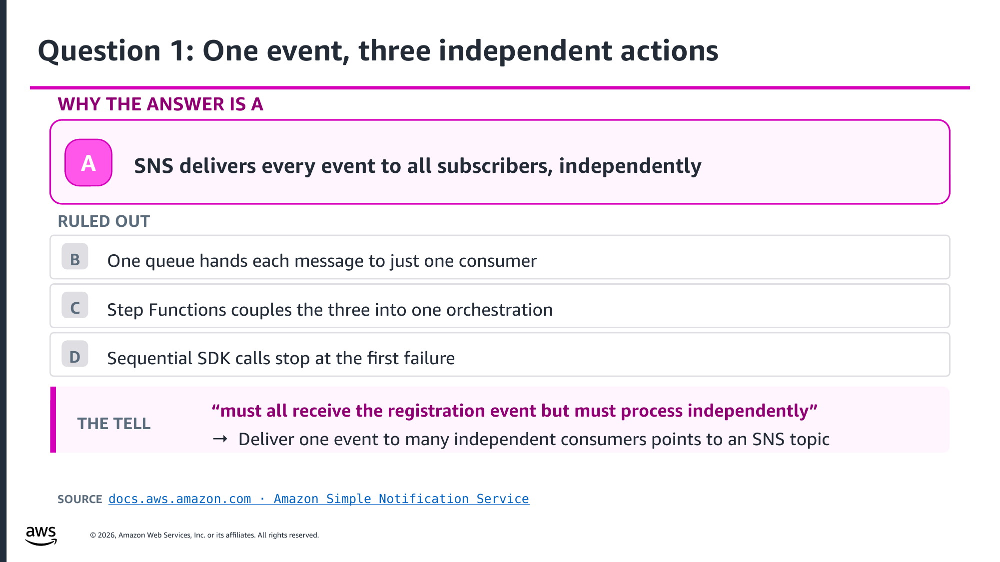

### Notes

WHAT'S HERE: the elimination, made visible. A win because sNS delivers every event to all subscribers, independently. The others are ruled out for one reason each: B — One queue hands each message to just one consumer; C — Step Functions couples the three into one orchestration; D — Sequential SDK calls stop at the first failure. Read the tell strip aloud -- pairing a phrase with what it signals is the transferable skill, not memorizing the service name.

EXAM RELEVANCE: Domain 1: Development with AWS Services. Difficulty: Medium. The pattern to teach: a scenario question rarely offers three absurd options. It offers ones that match a nearby requirement and one (or two) that match the requirement exactly. Here the discriminator is “must all receive the registration event but must process independently”, which points at Deliver one event to many independent consumers points to an SNS topic. Encourage the room to name the phrase before naming the service.

PARTNER CONTEXT: A customer's onboarding flow must fire several independent actions from one sign-up event -- a welcome email, a CRM record, a default workspace -- and one slow or failing step must not block the rest. An SNS topic with each function subscribed gives every consumer its own copy and its own failure domain, so a fourth action can be added later without touching the first three. This is the contrast that sets up EventBridge: SNS fans out to subscribers, EventBridge routes on the content of the event.

SOURCE: https://docs.aws.amazon.com/sns/latest/dg/sns-common-scenarios.html

---

## Slide 33 — Question 2: Cache a catalog that updates hourly

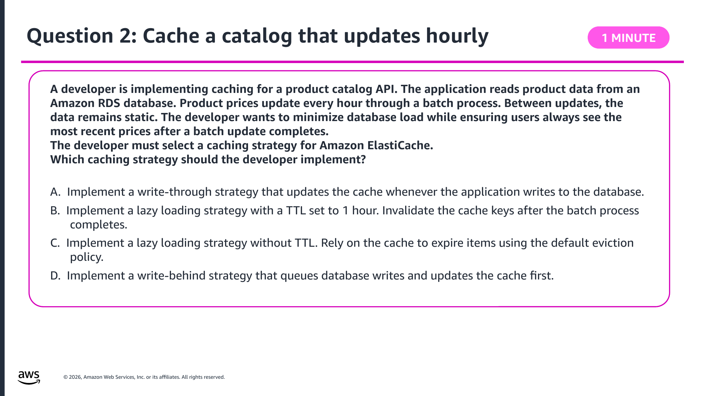

### Notes

WHAT'S HERE: put question 2 on screen and give the room about 90 seconds to read it in silence and commit to an answer before anyone speaks aloud. That is close to the pace the exam demands, so this rehearses timing as much as content.

Do not reveal or hint at the answer on this beat. The silent read is what makes the key-phrases beat and the reveal land -- if you talk through it now, both lose their effect.

EXAM RELEVANCE: Domain 1: Development with AWS Services. Difficulty: Medium. Watch the room: if most people have answered by 90 seconds, move on; if they are still reading, give another 20 seconds rather than rushing the discussion that follows.

PARTNER CONTEXT: A customer's product catalog reads dominate their database load, and prices only move on an hourly batch. Lazy loading with a one-hour TTL, plus invalidating the cache keys when the batch finishes, keeps the database quiet between runs and still surfaces new prices the moment they land. The value you add is matching the cache pattern to how the data actually changes, rather than reaching for write-through when the application itself never writes the prices.

EXAM MAPPING: Domain 1: Development with AWS Services.

---

## Slide 34 — Question 2: Cache a catalog that updates hourly

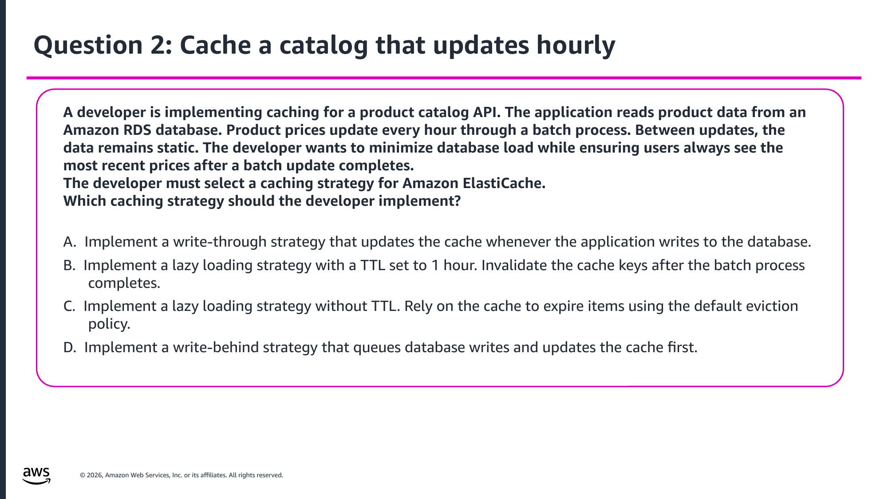

### Notes

KEY PHRASES: walk the question, do not answer it yet. The phrase that decides it is “users always see the most recent prices after a batch update completes”, and it tells you: Read-heavy with bounded staleness points to lazy loading plus a TTL.

WHAT'S HERE: the same question with the timer removed. This beat teaches HOW to read a scenario question -- find the requirement, then find the words that separate options that all look plausible on a first pass.

EXAM RELEVANCE: Domain 1: Development with AWS Services. Difficulty: Medium. Ask the room which words they underlined before you show them the tell, so they practise finding it rather than being handed it.

PARTNER CONTEXT: A customer's product catalog reads dominate their database load, and prices only move on an hourly batch. Lazy loading with a one-hour TTL, plus invalidating the cache keys when the batch finishes, keeps the database quiet between runs and still surfaces new prices the moment they land. The value you add is matching the cache pattern to how the data actually changes, rather than reaching for write-through when the application itself never writes the prices.

EXAM MAPPING: Domain 1: Development with AWS Services.

---

## Slide 35 — Question 2: Cache a catalog that updates hourly

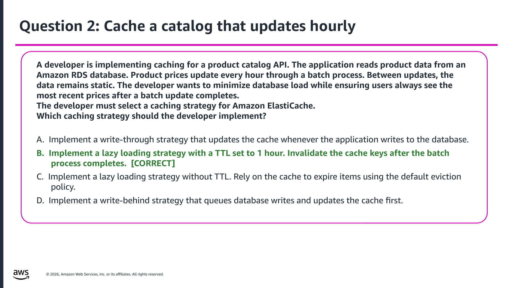

### Notes

ANSWER OVERVIEW: the answer is B. Lazy loading with a one-hour TTL bounds staleness.

A. Implement a write-through strategy that updates the cache whenever the application writes to the database. — Incorrect — Write-through updates the cache on every write. However, the batch price update process runs against the database directly, not through the application. Write-through only works when all writes go through the application layer. Direct database batch updates would leave the cache stale.

B. Implement a lazy loading strategy with a TTL set to 1 hour. Invalidate the cache keys after the batch process completes. — Correct — Lazy loading populates the cache on read misses. Setting a TTL of 1 hour provides a safety net for stale data. Invalidating cache keys after the batch update completes ensures that the next read fetches fresh data from the database. This combination minimizes database load during the hour between updates while guaranteeing fresh data after each batch.

C. Implement a lazy loading strategy without TTL. Rely on the cache to expire items using the default eviction policy. — Incorrect — Without a TTL or explicit invalidation, cached items persist until memory pressure triggers eviction. After a batch price update, users would continue to see stale prices until the item is evicted. The default eviction policy (allkeys-lru) does not guarantee timely updates after batch processing.

D. Implement a write-behind strategy that queues database writes and updates the cache first. — Incorrect — Write-behind (write-back) caching writes to the cache first and asynchronously updates the database. This is useful for write-heavy workloads where the application controls all writes. The batch process updates the database directly, so write-behind would not capture those changes in the cache.

EXAM RELEVANCE: Domain 1: Development with AWS Services. Difficulty: Medium.

SOURCE: https://docs.aws.amazon.com/whitepapers/latest/database-caching-strategies-using-redis/caching-patterns.html

---

## Slide 36 — Question 2: Cache a catalog that updates hourly

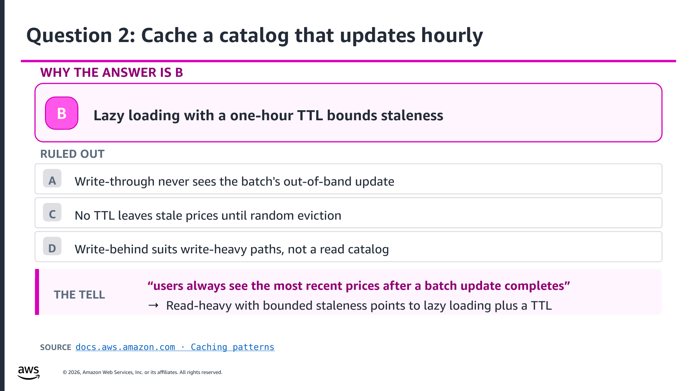

### Notes

WHAT'S HERE: the elimination, made visible. B win because lazy loading with a one-hour TTL bounds staleness. The others are ruled out for one reason each: A — Write-through never sees the batch's out-of-band update; C — No TTL leaves stale prices until random eviction; D — Write-behind suits write-heavy paths, not a read catalog. Read the tell strip aloud -- pairing a phrase with what it signals is the transferable skill, not memorizing the service name.

EXAM RELEVANCE: Domain 1: Development with AWS Services. Difficulty: Medium. The pattern to teach: a scenario question rarely offers three absurd options. It offers ones that match a nearby requirement and one (or two) that match the requirement exactly. Here the discriminator is “users always see the most recent prices after a batch update completes”, which points at Read-heavy with bounded staleness points to lazy loading plus a TTL. Encourage the room to name the phrase before naming the service.

PARTNER CONTEXT: A customer's product catalog reads dominate their database load, and prices only move on an hourly batch. Lazy loading with a one-hour TTL, plus invalidating the cache keys when the batch finishes, keeps the database quiet between runs and still surfaces new prices the moment they land. The value you add is matching the cache pattern to how the data actually changes, rather than reaching for write-through when the application itself never writes the prices.

SOURCE: https://docs.aws.amazon.com/whitepapers/latest/database-caching-strategies-using-redis/caching-patterns.html

---

## Slide 37 — Question 3: Sign in, then reach S3 as the user

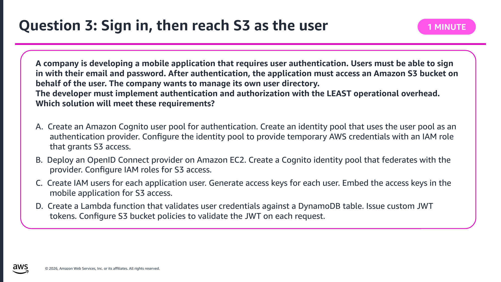

### Notes

WHAT'S HERE: put question 3 on screen and give the room about 90 seconds to read it in silence and commit to an answer before anyone speaks aloud. That is close to the pace the exam demands, so this rehearses timing as much as content.

Do not reveal or hint at the answer on this beat. The silent read is what makes the key-phrases beat and the reveal land -- if you talk through it now, both lose their effect.

EXAM RELEVANCE: Domain 2: Security. Difficulty: Medium. Watch the room: if most people have answered by 90 seconds, move on; if they are still reading, give another 20 seconds rather than rushing the discussion that follows.

PARTNER CONTEXT: A customer building a mobile app wants to own their user directory and still let each signed-in user reach an S3 bucket as themselves. A Cognito user pool handles sign-in, and an identity pool vends short-lived AWS credentials scoped by an IAM role, so no long-lived keys ever ship inside the app and there is no auth server to run or patch. The discriminator to teach is 'own directory' plus 'temporary AWS credentials' -- user pool for who you are, identity pool for what you may do.

EXAM MAPPING: Domain 2: Security.

---

## Slide 38 — Question 3: Sign in, then reach S3 as the user

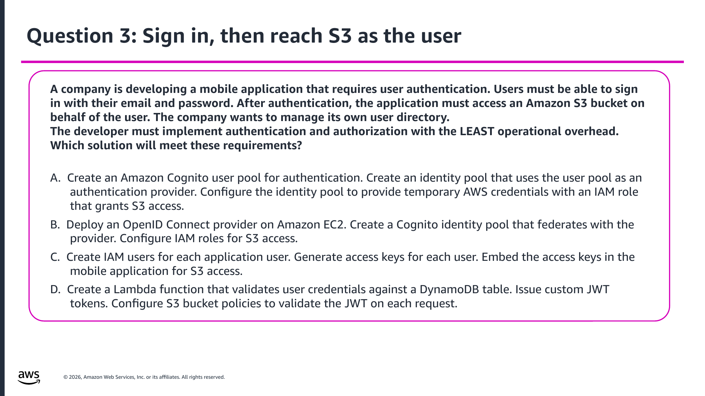

### Notes

KEY PHRASES: walk the question, do not answer it yet. The phrase that decides it is “manage its own user directory”, and it tells you: Own directory plus temporary AWS credentials points to Cognito pools.

WHAT'S HERE: the same question with the timer removed. This beat teaches HOW to read a scenario question -- find the requirement, then find the words that separate options that all look plausible on a first pass.

EXAM RELEVANCE: Domain 2: Security. Difficulty: Medium. Ask the room which words they underlined before you show them the tell, so they practise finding it rather than being handed it.

PARTNER CONTEXT: A customer building a mobile app wants to own their user directory and still let each signed-in user reach an S3 bucket as themselves. A Cognito user pool handles sign-in, and an identity pool vends short-lived AWS credentials scoped by an IAM role, so no long-lived keys ever ship inside the app and there is no auth server to run or patch. The discriminator to teach is 'own directory' plus 'temporary AWS credentials' -- user pool for who you are, identity pool for what you may do.

EXAM MAPPING: Domain 2: Security.

---

## Slide 39 — Question 3: Sign in, then reach S3 as the user

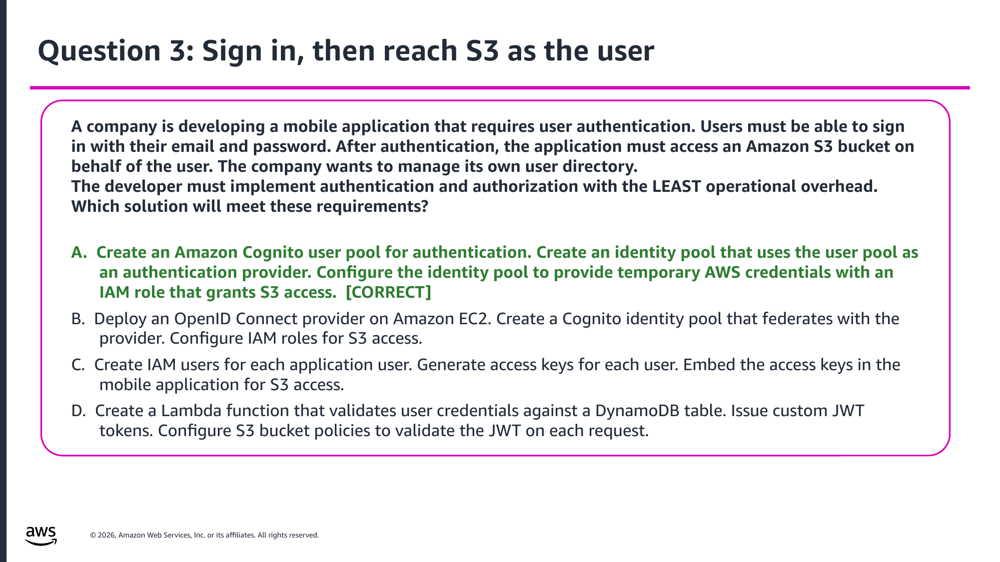

### Notes

ANSWER OVERVIEW: the answer is A. A user pool signs users in, an identity pool grants S3.

A. Create an Amazon Cognito user pool for authentication. Create an identity pool that uses the user pool as an authentication provider. Configure the identity pool to provide temporary AWS credentials with an IAM role that grants S3 access. — Correct — A Cognito user pool provides a managed user directory with email/password authentication. An identity pool exchanges user pool tokens for temporary AWS credentials scoped to an IAM role. This gives authenticated users direct S3 access without managing infrastructure or credential distribution.

B. Deploy an OpenID Connect provider on Amazon EC2. Create a Cognito identity pool that federates with the provider. Configure IAM roles for S3 access. — Incorrect — Deploying and managing a custom OpenID Connect provider on EC2 requires patching, scaling, and maintaining the authentication server. This adds significant operational overhead compared to using Cognito user pools as the managed user directory.

C. Create IAM users for each application user. Generate access keys for each user. Embed the access keys in the mobile application for S3 access. — Incorrect — Creating IAM users for application users does not scale. IAM has account-level limits on the number of users. Embedding long-term access keys in mobile applications is a security risk. If the application binary is decompiled, the keys are exposed. IAM users are for AWS administrative access, not application end users.

D. Create a Lambda function that validates user credentials against a DynamoDB table. Issue custom JWT tokens. Configure S3 bucket policies to validate the JWT on each request. — Incorrect — S3 bucket policies cannot validate custom JWT tokens. S3 evaluates IAM-based access policies and does not have a mechanism to parse or verify JWT claims in request headers. Additionally, managing a custom authentication system with DynamoDB adds operational overhead.

EXAM RELEVANCE: Domain 2: Security. Difficulty: Medium.

SOURCE: https://docs.aws.amazon.com/cognito/latest/developerguide/cognito-identity.html

---

## Slide 40 — Question 3: Sign in, then reach S3 as the user

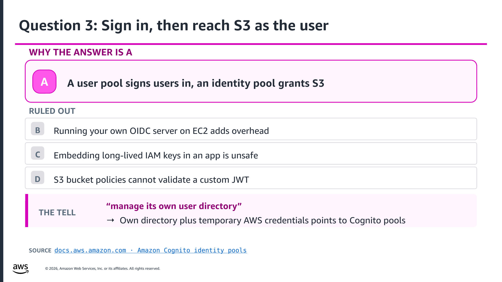

### Notes

WHAT'S HERE: the elimination, made visible. A win because a user pool signs users in, an identity pool grants S3. The others are ruled out for one reason each: B — Running your own OIDC server on EC2 adds overhead; C — Embedding long-lived IAM keys in an app is unsafe; D — S3 bucket policies cannot validate a custom JWT. Read the tell strip aloud -- pairing a phrase with what it signals is the transferable skill, not memorizing the service name.

EXAM RELEVANCE: Domain 2: Security. Difficulty: Medium. The pattern to teach: a scenario question rarely offers three absurd options. It offers ones that match a nearby requirement and one (or two) that match the requirement exactly. Here the discriminator is “manage its own user directory”, which points at Own directory plus temporary AWS credentials points to Cognito pools. Encourage the room to name the phrase before naming the service.

PARTNER CONTEXT: A customer building a mobile app wants to own their user directory and still let each signed-in user reach an S3 bucket as themselves. A Cognito user pool handles sign-in, and an identity pool vends short-lived AWS credentials scoped by an IAM role, so no long-lived keys ever ship inside the app and there is no auth server to run or patch. The discriminator to teach is 'own directory' plus 'temporary AWS credentials' -- user pool for who you are, identity pool for what you may do.

SOURCE: https://docs.aws.amazon.com/cognito/latest/developerguide/cognito-identity.html

---

## Slide 41 — Question 4: Alarm when orders run slow

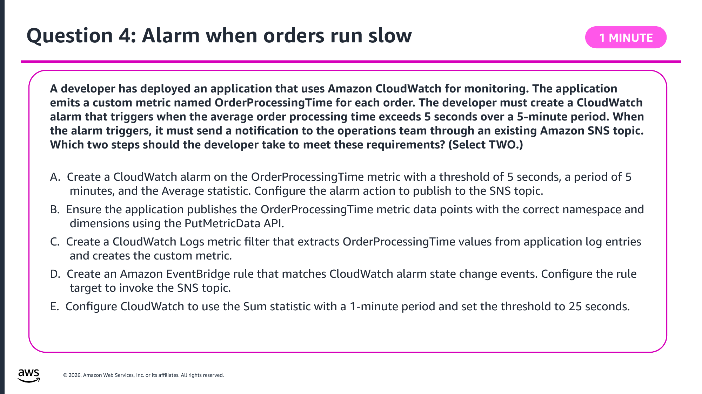

### Notes

WHAT'S HERE: put question 4 on screen and give the room about 90 seconds to read it in silence and commit to an answer before anyone speaks aloud. Note this is a select-two question, so tell the room to expect more than one answer. That is close to the pace the exam demands, so this rehearses timing as much as content.

Do not reveal or hint at the answer on this beat. The silent read is what makes the key-phrases beat and the reveal land -- if you talk through it now, both lose their effect.

EXAM RELEVANCE: Domain 4: Troubleshooting and Optimization. Difficulty: Medium. Watch the room: if most people have answered by 90 seconds, move on; if they are still reading, give another 20 seconds rather than rushing the discussion that follows.

PARTNER CONTEXT: A customer's operations team wants to hear about slow orders without watching a dashboard. Publishing OrderProcessingTime with the PutMetricData API so the metric exists, then alarming on its five-minute Average with the action wired to their existing SNS topic, pages them only when it matters. The point worth making is that a custom metric has to be published before an alarm can watch it -- the two correct steps are 'create the data' and 'watch the data', in that order.

EXAM MAPPING: Domain 4: Troubleshooting and Optimization.

---

## Slide 42 — Question 4: Alarm when orders run slow

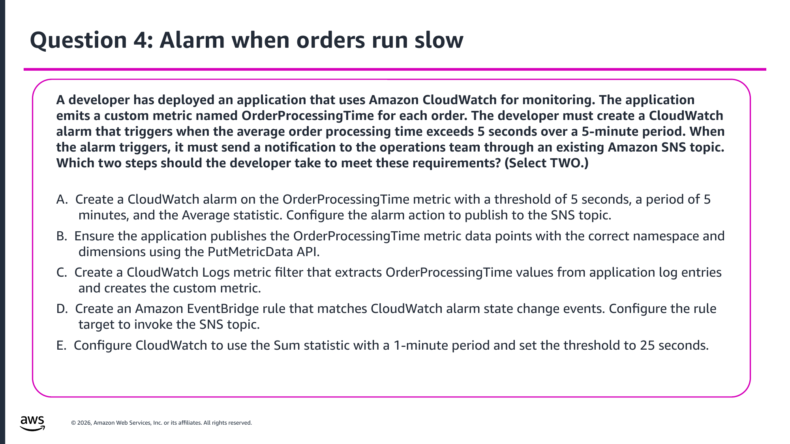

### Notes

KEY PHRASES: walk the question, do not answer it yet. The phrase that decides it is “average order processing time exceeds 5 seconds over a 5-minute period”, and it tells you: An average over a window plus a notification points to an alarm with an SNS action.

WHAT'S HERE: the same question with the timer removed. This beat teaches HOW to read a scenario question -- find the requirement, then find the words that separate options that all look plausible on a first pass.

EXAM RELEVANCE: Domain 4: Troubleshooting and Optimization. Difficulty: Medium. Ask the room which words they underlined before you show them the tell, so they practise finding it rather than being handed it.

PARTNER CONTEXT: A customer's operations team wants to hear about slow orders without watching a dashboard. Publishing OrderProcessingTime with the PutMetricData API so the metric exists, then alarming on its five-minute Average with the action wired to their existing SNS topic, pages them only when it matters. The point worth making is that a custom metric has to be published before an alarm can watch it -- the two correct steps are 'create the data' and 'watch the data', in that order.

EXAM MAPPING: Domain 4: Troubleshooting and Optimization.

---

## Slide 43 — Question 4: Alarm when orders run slow

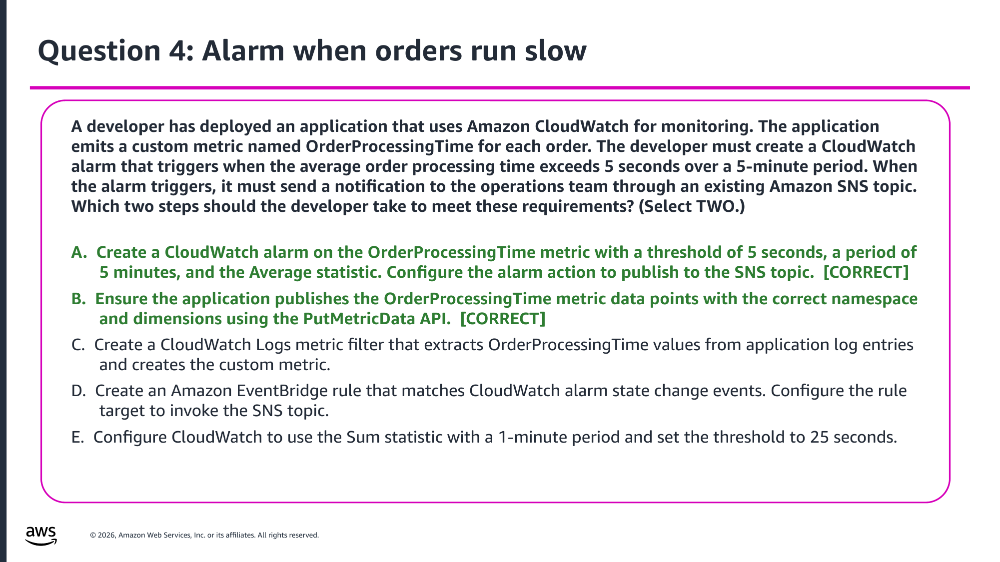

### Notes

ANSWER OVERVIEW: the answer is A and B. Publish the metric, then alarm on its five-minute average.

A. Create a CloudWatch alarm on the OrderProcessingTime metric with a threshold of 5 seconds, a period of 5 minutes, and the Average statistic. Configure the alarm action to publish to the SNS topic. — Correct — A CloudWatch alarm evaluates a metric against a threshold over a specified period. Setting the statistic to Average with a period of 300 seconds (5 minutes) and threshold of 5 seconds matches the requirement. Configuring the SNS topic as the alarm action sends the notification when the alarm state changes to ALARM.

B. Ensure the application publishes the OrderProcessingTime metric data points with the correct namespace and dimensions using the PutMetricData API. — Correct — For a CloudWatch alarm to evaluate a custom metric, the application must publish metric data points to CloudWatch using the PutMetricData API. The metric must use a consistent namespace and dimensions so the alarm can locate and evaluate the correct data points.

C. Create a CloudWatch Logs metric filter that extracts OrderProcessingTime values from application log entries and creates the custom metric. — Incorrect — The question states the application already emits a custom metric named OrderProcessingTime. A metric filter extracts metric data from log entries. Since the application directly publishes the metric, a metric filter is not needed and would create a duplicate metric.

D. Create an Amazon EventBridge rule that matches CloudWatch alarm state change events. Configure the rule target to invoke the SNS topic. — Incorrect — While EventBridge can capture CloudWatch alarm state changes, this adds unnecessary complexity. CloudWatch alarms natively support SNS topics as alarm actions. Direct integration between the alarm and SNS is simpler and does not require an additional EventBridge rule.

E. Configure CloudWatch to use the Sum statistic with a 1-minute period and set the threshold to 25 seconds. — Incorrect — Using the Sum statistic would add all processing times together. If 10 orders are processed in 5 minutes each taking 3 seconds, the sum would be 30 seconds and trigger the alarm even though no individual order exceeded 5 seconds. The requirement calls for the Average statistic over a 5-minute period.

EXAM RELEVANCE: Domain 4: Troubleshooting and Optimization. Difficulty: Medium.

SOURCE: https://docs.aws.amazon.com/AmazonCloudWatch/latest/monitoring/AlarmThatSendsEmail.html

---

## Slide 44 — Question 4: Alarm when orders run slow

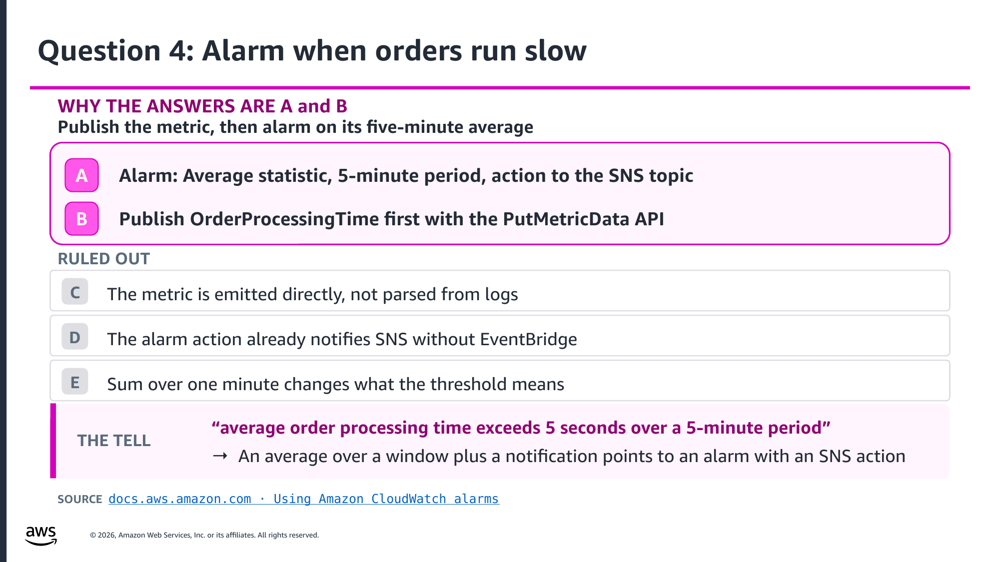

### Notes

WHAT'S HERE: the elimination, made visible. A and B are both required: publish the metric, then alarm on its five-minute average. The others are ruled out for one reason each: C — The metric is emitted directly, not parsed from logs; D — The alarm action already notifies SNS without EventBridge; E — Sum over one minute changes what the threshold means. Read the tell strip aloud -- pairing a phrase with what it signals is the transferable skill, not memorizing the service name.

EXAM RELEVANCE: Domain 4: Troubleshooting and Optimization. Difficulty: Medium. The pattern to teach: a scenario question rarely offers three absurd options. It offers ones that match a nearby requirement and one (or two) that match the requirement exactly. Here the discriminator is “average order processing time exceeds 5 seconds over a 5-minute period”, which points at An average over a window plus a notification points to an alarm with an SNS action. Encourage the room to name the phrase before naming the service.

PARTNER CONTEXT: A customer's operations team wants to hear about slow orders without watching a dashboard. Publishing OrderProcessingTime with the PutMetricData API so the metric exists, then alarming on its five-minute Average with the action wired to their existing SNS topic, pages them only when it matters. The point worth making is that a custom metric has to be published before an alarm can watch it -- the two correct steps are 'create the data' and 'watch the data', in that order.

SOURCE: https://docs.aws.amazon.com/AmazonCloudWatch/latest/monitoring/AlarmThatSendsEmail.html

---

## Slide 45 — Question 5: Cut the hunt when an alarm fires

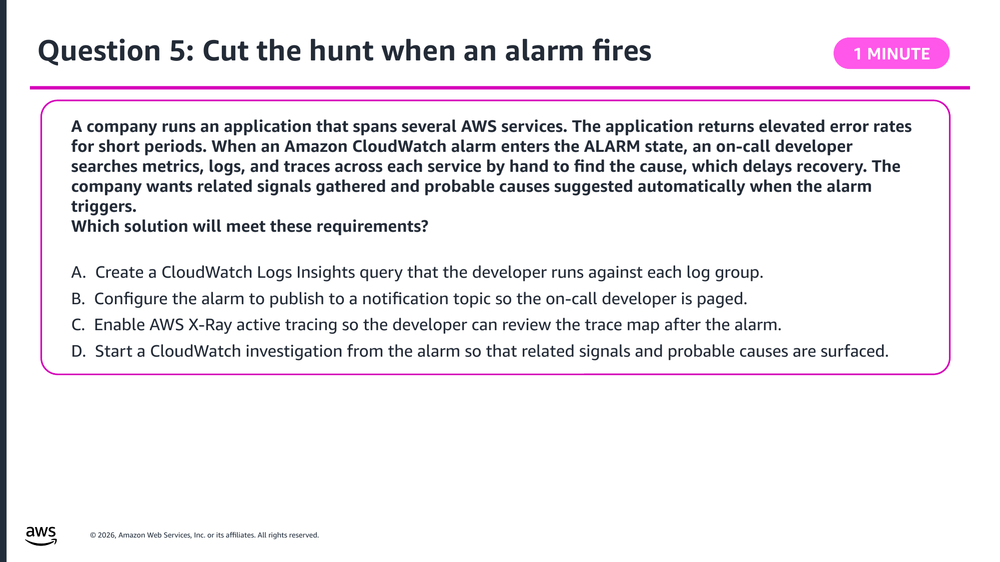

### Notes

WHAT'S HERE: put question 5 on screen and give the room about 90 seconds to read it in silence and commit to an answer before anyone speaks aloud. That is close to the pace the exam demands, so this rehearses timing as much as content.

Do not reveal or hint at the answer on this beat. The silent read is what makes the key-phrases beat and the reveal land -- if you talk through it now, both lose their effect.

EXAM RELEVANCE: Domain 4: Troubleshooting and Optimization. Difficulty: Medium. Watch the room: if most people have answered by 90 seconds, move on; if they are still reading, give another 20 seconds rather than rushing the discussion that follows.

PARTNER CONTEXT: A customer loses time on every incident because the on-call developer hand-searches metrics, logs and traces across each service after an alarm fires. Starting a CloudWatch investigation from the alarm gathers the related signals and suggests probable causes automatically, so recovery starts from a short list instead of a blank page. Contrast it with paging or a saved query: those tell a human to go look, whereas the investigation does the correlation itself.

EXAM MAPPING: Domain 4: Troubleshooting and Optimization.

---

## Slide 46 — Question 5: Cut the hunt when an alarm fires

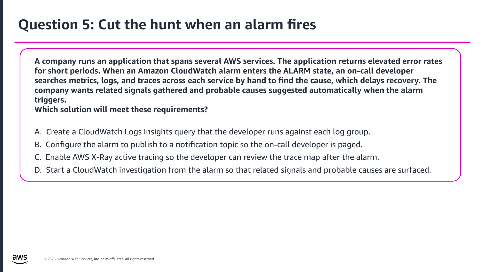

### Notes

KEY PHRASES: walk the question, do not answer it yet. The phrase that decides it is “related signals gathered and probable causes suggested automatically”, and it tells you: Auto-correlate signals and suggest causes points to a CloudWatch investigation.

WHAT'S HERE: the same question with the timer removed. This beat teaches HOW to read a scenario question -- find the requirement, then find the words that separate options that all look plausible on a first pass.

EXAM RELEVANCE: Domain 4: Troubleshooting and Optimization. Difficulty: Medium. Ask the room which words they underlined before you show them the tell, so they practise finding it rather than being handed it.

PARTNER CONTEXT: A customer loses time on every incident because the on-call developer hand-searches metrics, logs and traces across each service after an alarm fires. Starting a CloudWatch investigation from the alarm gathers the related signals and suggests probable causes automatically, so recovery starts from a short list instead of a blank page. Contrast it with paging or a saved query: those tell a human to go look, whereas the investigation does the correlation itself.

EXAM MAPPING: Domain 4: Troubleshooting and Optimization.

---

## Slide 47 — Question 5: Cut the hunt when an alarm fires

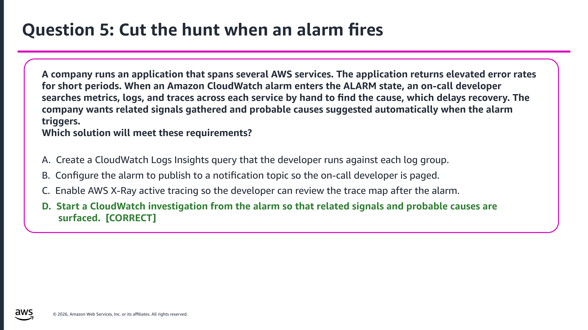

### Notes

ANSWER OVERVIEW: the answer is D. An investigation gathers signals and suggests causes automatically.

A. Create a CloudWatch Logs Insights query that the developer runs against each log group. — Incorrect — A Logs Insights query returns results only for the log groups it is run against, and a person runs it and interprets the output. It gathers no metrics or traces and suggests no probable cause.

B. Configure the alarm to publish to a notification topic so the on-call developer is paged. — Incorrect — Publishing the alarm to a notification topic tells the developer that the alarm changed state. It delivers no correlated signals and no suggested cause, so the manual search still follows.

C. Enable AWS X-Ray active tracing so the developer can review the trace map after the alarm. — Incorrect — The X-Ray trace map shows service relationships and where faults occur, which is useful evidence, but a person still reads the map and correlates it with metrics and logs. Nothing is gathered or suggested automatically when the alarm triggers.

D. Start a CloudWatch investigation from the alarm so that related signals and probable causes are surfaced. — Correct — CloudWatch investigations can be started from an alarm and use artificial intelligence to gather related metrics, logs, traces, and recent changes across services. The investigation surfaces suggested probable causes, which replaces the manual search the on-call developer performs.

EXAM RELEVANCE: Domain 4: Troubleshooting and Optimization. Difficulty: Medium.

SOURCE: https://docs.aws.amazon.com/AmazonCloudWatch/latest/monitoring/Start-Investigation-Alarm.html

---

## Slide 48 — Question 5: Cut the hunt when an alarm fires

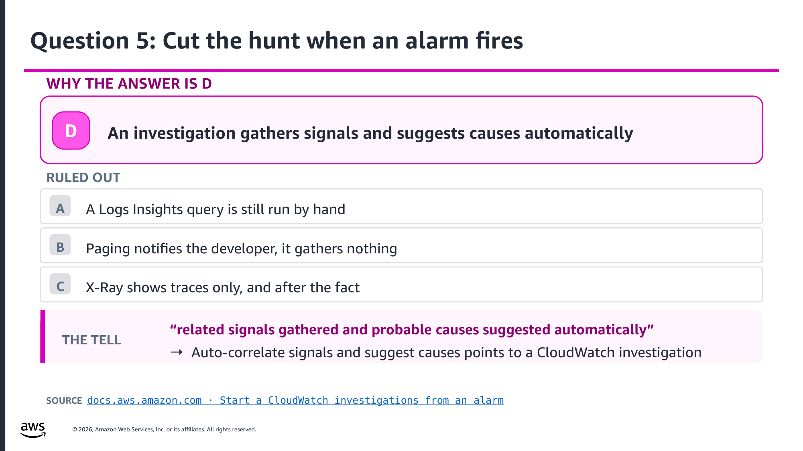

### Notes

WHAT'S HERE: the elimination, made visible. D win because an investigation gathers signals and suggests causes automatically. The others are ruled out for one reason each: A — A Logs Insights query is still run by hand; B — Paging notifies the developer, it gathers nothing; C — X-Ray shows traces only, and after the fact. Read the tell strip aloud -- pairing a phrase with what it signals is the transferable skill, not memorizing the service name.

EXAM RELEVANCE: Domain 4: Troubleshooting and Optimization. Difficulty: Medium. The pattern to teach: a scenario question rarely offers three absurd options. It offers ones that match a nearby requirement and one (or two) that match the requirement exactly. Here the discriminator is “related signals gathered and probable causes suggested automatically”, which points at Auto-correlate signals and suggest causes points to a CloudWatch investigation. Encourage the room to name the phrase before naming the service.

PARTNER CONTEXT: A customer loses time on every incident because the on-call developer hand-searches metrics, logs and traces across each service after an alarm fires. Starting a CloudWatch investigation from the alarm gathers the related signals and suggests probable causes automatically, so recovery starts from a short list instead of a blank page. Contrast it with paging or a saved query: those tell a human to go look, whereas the investigation does the correlation itself.

SOURCE: https://docs.aws.amazon.com/AmazonCloudWatch/latest/monitoring/Start-Investigation-Alarm.html

---

## Slide 49 — Question 6: Find one customer across messy logs

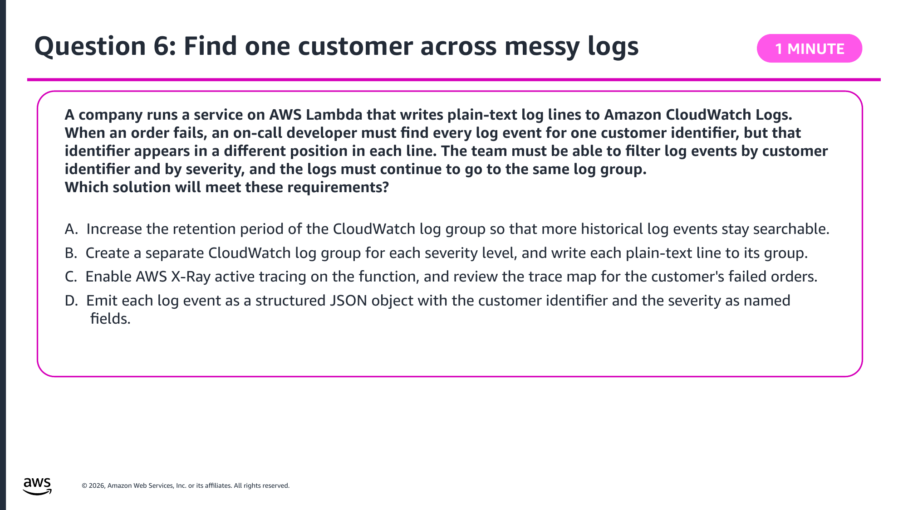

### Notes

WHAT'S HERE: put question 6 on screen and give the room about 90 seconds to read it in silence and commit to an answer before anyone speaks aloud. That is close to the pace the exam demands, so this rehearses timing as much as content.

Do not reveal or hint at the answer on this beat. The silent read is what makes the key-phrases beat and the reveal land -- if you talk through it now, both lose their effect.

EXAM RELEVANCE: Domain 4: Troubleshooting and Optimization. Difficulty: Medium. Watch the room: if most people have answered by 90 seconds, move on; if they are still reading, give another 20 seconds rather than rushing the discussion that follows.

PARTNER CONTEXT: A customer's plain-text Lambda logs put the customer identifier in a different position on every line, so filtering by customer or by severity is guesswork. Emitting each event as a JSON object with named fields makes those values discoverable and filterable, and the logs still flow to the same log group. The change is in what the code logs, not where the logs go -- structure at write time is what turns an unsearchable line into a queryable record.

EXAM MAPPING: Domain 4: Troubleshooting and Optimization.

---

## Slide 50 — Question 6: Find one customer across messy logs

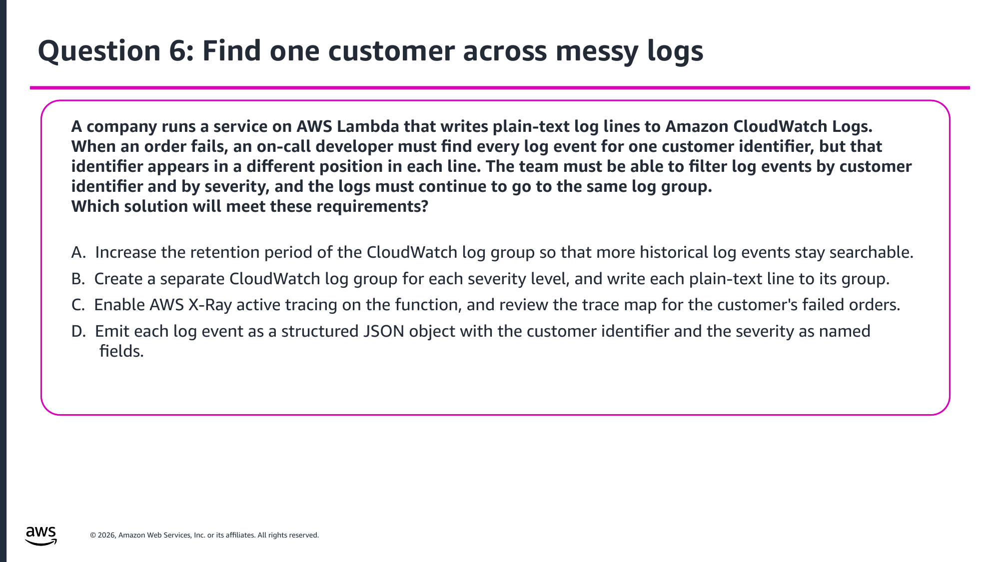

### Notes

KEY PHRASES: walk the question, do not answer it yet. The phrase that decides it is “filter log events by customer identifier and by severity”, and it tells you: Filter by a field regardless of position points to structured JSON logs.

WHAT'S HERE: the same question with the timer removed. This beat teaches HOW to read a scenario question -- find the requirement, then find the words that separate options that all look plausible on a first pass.

EXAM RELEVANCE: Domain 4: Troubleshooting and Optimization. Difficulty: Medium. Ask the room which words they underlined before you show them the tell, so they practise finding it rather than being handed it.

PARTNER CONTEXT: A customer's plain-text Lambda logs put the customer identifier in a different position on every line, so filtering by customer or by severity is guesswork. Emitting each event as a JSON object with named fields makes those values discoverable and filterable, and the logs still flow to the same log group. The change is in what the code logs, not where the logs go -- structure at write time is what turns an unsearchable line into a queryable record.

EXAM MAPPING: Domain 4: Troubleshooting and Optimization.

---

## Slide 51 — Question 6: Find one customer across messy logs

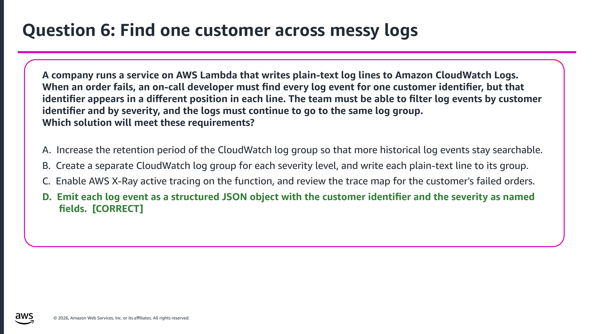

### Notes

ANSWER OVERVIEW: the answer is D. Named JSON fields let you filter by any value.

A. Increase the retention period of the CloudWatch log group so that more historical log events stay searchable. — Incorrect — Retention controls how long CloudWatch Logs keeps events before deleting them. It makes older events available but does nothing to make the customer identifier or the severity addressable as a field, so the developer still reads unstructured lines.

B. Create a separate CloudWatch log group for each severity level, and write each plain-text line to its group. — Incorrect — Splitting by severity moves the log events to new log groups, which the requirement rules out, and it still leaves the customer identifier buried in free text. It also multiplies the log groups the developer must search for a single customer.

C. Enable AWS X-Ray active tracing on the function, and review the trace map for the customer's failed orders. — Incorrect — The X-Ray trace map shows service relationships and where faults occur, which helps locate a slow or failing dependency. Traces are not log events, so the map cannot filter the function's log output by customer identifier or severity.

D. Emit each log event as a structured JSON object with the customer identifier and the severity as named fields. — Correct — When a Lambda function writes log events as JSON, CloudWatch Logs Insights automatically discovers the top-level JSON keys as queryable fields. The developer can then filter on the customer identifier field and the severity field directly instead of matching text by position, and the events still go to the function's existing log group. Position in the line stops mattering because each value is addressed by name.

EXAM RELEVANCE: Domain 4: Troubleshooting and Optimization. Difficulty: Medium.

SOURCE: https://docs.aws.amazon.com/AmazonCloudWatch/latest/logs/CWL_AnalyzeLogData-discoverable-fields.html

---

## Slide 52 — Question 6: Find one customer across messy logs

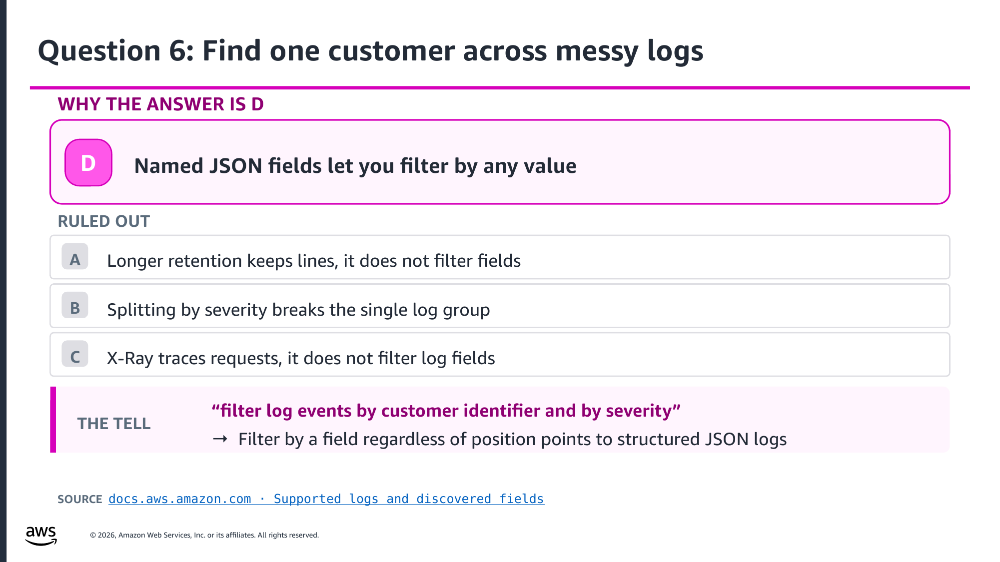

### Notes

WHAT'S HERE: the elimination, made visible. D win because named JSON fields let you filter by any value. The others are ruled out for one reason each: A — Longer retention keeps lines, it does not filter fields; B — Splitting by severity breaks the single log group; C — X-Ray traces requests, it does not filter log fields. Read the tell strip aloud -- pairing a phrase with what it signals is the transferable skill, not memorizing the service name.

EXAM RELEVANCE: Domain 4: Troubleshooting and Optimization. Difficulty: Medium. The pattern to teach: a scenario question rarely offers three absurd options. It offers ones that match a nearby requirement and one (or two) that match the requirement exactly. Here the discriminator is “filter log events by customer identifier and by severity”, which points at Filter by a field regardless of position points to structured JSON logs. Encourage the room to name the phrase before naming the service.

PARTNER CONTEXT: A customer's plain-text Lambda logs put the customer identifier in a different position on every line, so filtering by customer or by severity is guesswork. Emitting each event as a JSON object with named fields makes those values discoverable and filterable, and the logs still flow to the same log group. The change is in what the code logs, not where the logs go -- structure at write time is what turns an unsearchable line into a queryable record.

SOURCE: https://docs.aws.amazon.com/AmazonCloudWatch/latest/logs/CWL_AnalyzeLogData-discoverable-fields.html

---

## Slide 53 — Coming up: Week 4 digital training

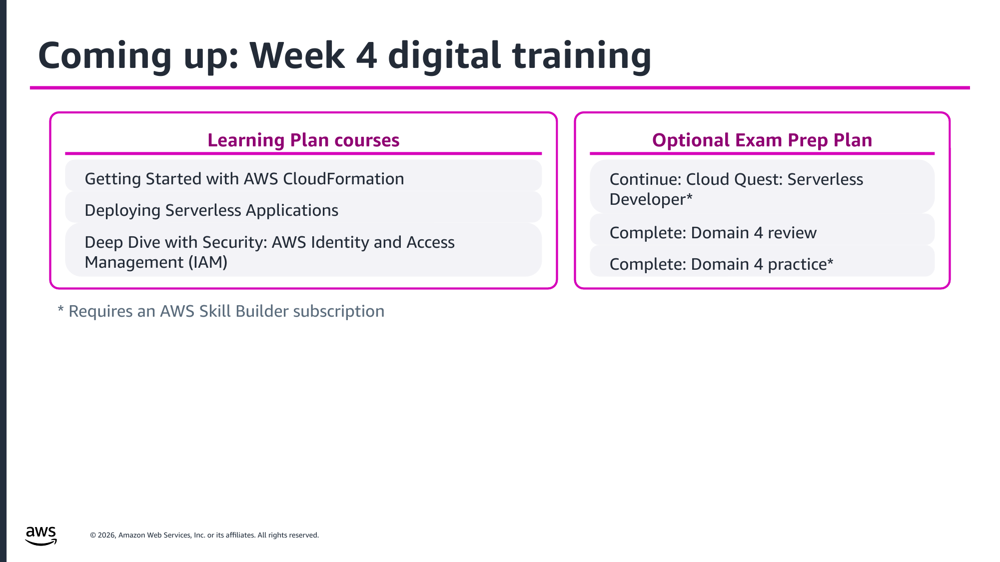

### Notes

WHAT'S HERE: A preview of next week's training so people can get a head start whenever they are ready. The left card is the free Learning Plan; the right card is the optional Exam Prep Plan a subscriber can add.

FACILITATOR: Keep this light -- it is a look ahead, not an assignment for today. Note that week four moves into infrastructure as code with CloudFormation, serverless deployment, and a security deep dive on IAM, which builds directly on this week's integration and monitoring work.

Encourage anyone who is ahead to start early, and reassure anyone still catching up on week three that the sessions build gradually.

Note: the item names beginning "Domain 4" are the actual Exam Prep Plan module names in Skill Builder, so learners can locate them; they are navigation, not exam-coverage claims.

---

## Slide 54 — Q&A time

### Notes

FACILITATOR: Open the floor. Invite questions on anything from this week's services -- messaging and events, caching, authentication, monitoring -- to study logistics and exam scheduling.

If the room is quiet, prime it with a question of your own. Ask which service felt least clear this week, or how people are finding the practice questions.

Keep answers short and point to the relevant documentation or the exam prep resources where a deeper follow-up is warranted.

---

## Slide 55 — Thank you for joining!

### Notes

FACILITATOR: Close warmly. Thank the room for their time and their engagement, and remind them of the two things that keep momentum: finish this week's training and make a start on next week's preview.

Restate when the next session is and encourage anyone who has not yet scheduled their exam to plan a target date.

End on encouragement -- they are building real, job-relevant skills, and steady weekly progress is what gets them exam-ready.

---

## Slide 56 — Appendix -- DVA-C02 reference

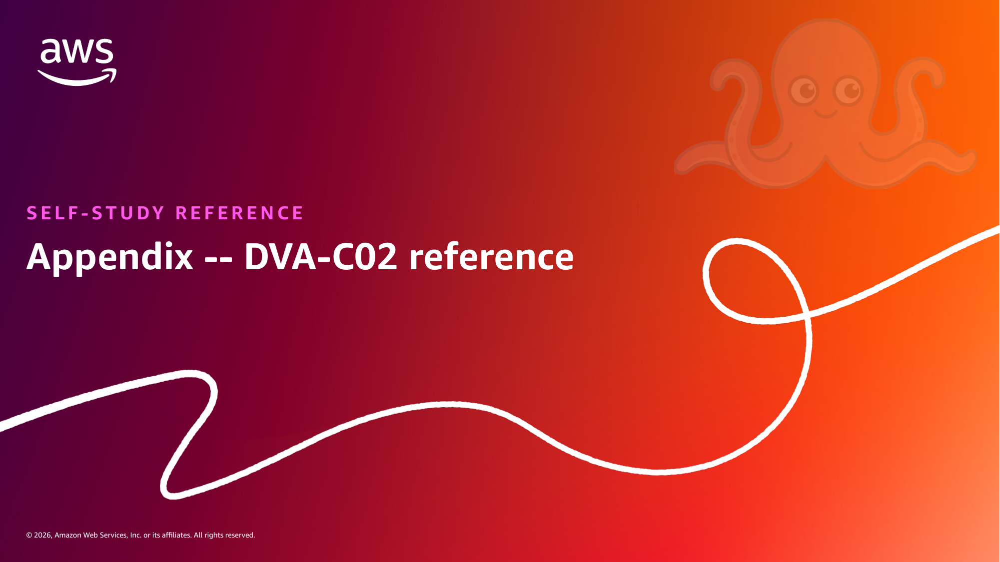

### Notes

APPENDIX: divider. This block is self-study reference for anyone who plans to sit DVA-C02 rather than C03. It is not taught in the session -- point the room at it and move on. The three appendix slides sit together at the end of the deck by design.

WHAT'S HERE: The session decks are built for DVA-C03. This appendix collects what a C02 candidate needs that the C03 body does not spell out: how the exam guide's weightings shifted, and what changed for this week's topics.

EXAM RELEVANCE: DVA-C02 is the live exam today; DVA-C03 is the version this course trains toward. AWS AppSync is in the published DVA-C02 in-scope list and is not taught in this C03-targeted body, so a C02 candidate studies it separately.

REFERENCE: The C02 figures come from the DVA-C02 exam guide; the C03 figures come from the September 2026 certification updates blog. Both are linked from the delta slides that follow. EXAM MAPPING: DVA-C02 to DVA-C03 comparison.

---

## Slide 57 — How C02 and C03 differ for this week

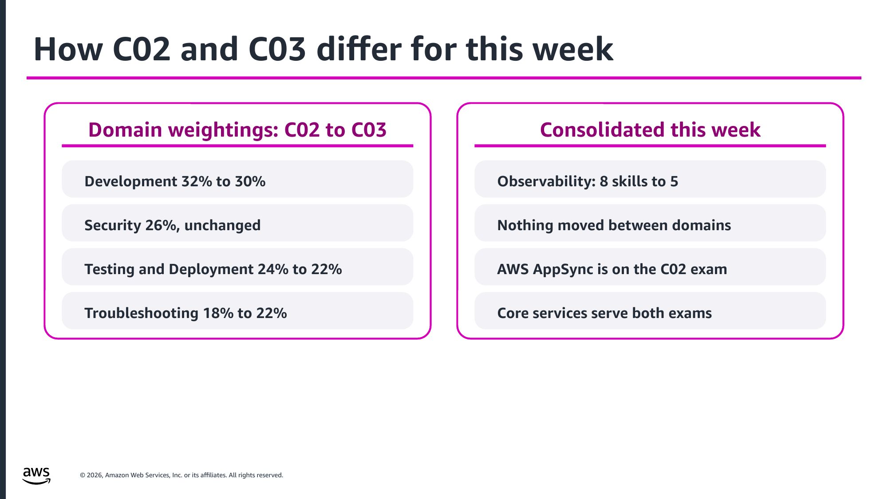

### Notes

APPENDIX: week-3 delta table. Walk the left column first: the four domain weightings barely move. Development eases from 32% to 30%, Security holds at 26%, Testing and Deployment eases from 24% to 22%, and Troubleshooting and Optimization rises from 18% to 22% -- the largest single shift.

WHAT'S HERE: The right column is week 3's story. Nothing moves between domains this week. Observability consolidates -- C02 spread eight observability skills across Domain 4, and C03 merges three of them into five.

The other week-3 note is AWS AppSync. It is in the published DVA-C02 in-scope list and is not taught in this C03-targeted body.

EXAM RELEVANCE: The monitoring and messaging services taught this week are the same on both exams; only their skill granularity tightens. A C02 candidate studies AppSync as well, because it is still in scope for that exam.

REFERENCE: C02 weightings and domains are from the DVA-C02 exam guide at docs.aws.amazon.com/aws-certification/latest/developer-associate-02/; the C03 consolidation is quoted from the September 2026 certification updates blog, linked on this slide. EXAM MAPPING: Domain 4 observability consolidation, plus AppSync on the C02 exam.

---

## Slide 58 — What a DVA-C02 candidate needs here

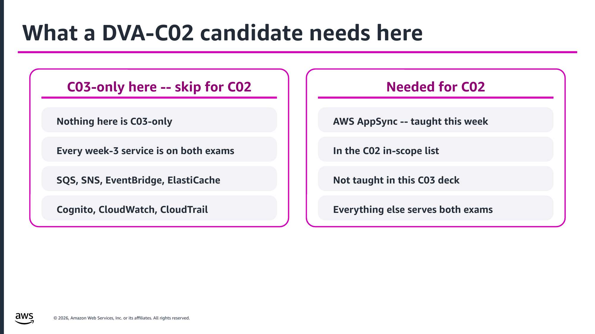

### Notes

APPENDIX: C02 reference. For a candidate sitting C02 rather than C03, this slide covers the Session 3 body. The left column is short by design: nothing taught this week was added only for C03, so there is no section a C02 candidate should skip.

Every week-3 service -- SQS, SNS, EventBridge, ElastiCache, Cognito, CloudWatch, CloudWatch Logs and CloudTrail -- is in scope on both exams and should be studied for either.

WHAT'S HERE: The right column is the one real difference. AWS AppSync is in the published DVA-C02 in-scope list, so it is taught here for C02 candidates even though this deck targets C03.

EXAM RELEVANCE: AppSync is the one service in the program that a C02 candidate needs and this C03-targeted body does not teach. Point a C02 candidate at it explicitly rather than letting them infer from its absence.

REFERENCE: Grounded in the public DVA-C02 exam guide and the September 2026 certification updates blog. EXAM MAPPING: DVA-C02 versus DVA-C03 scope for Session 3.

---
